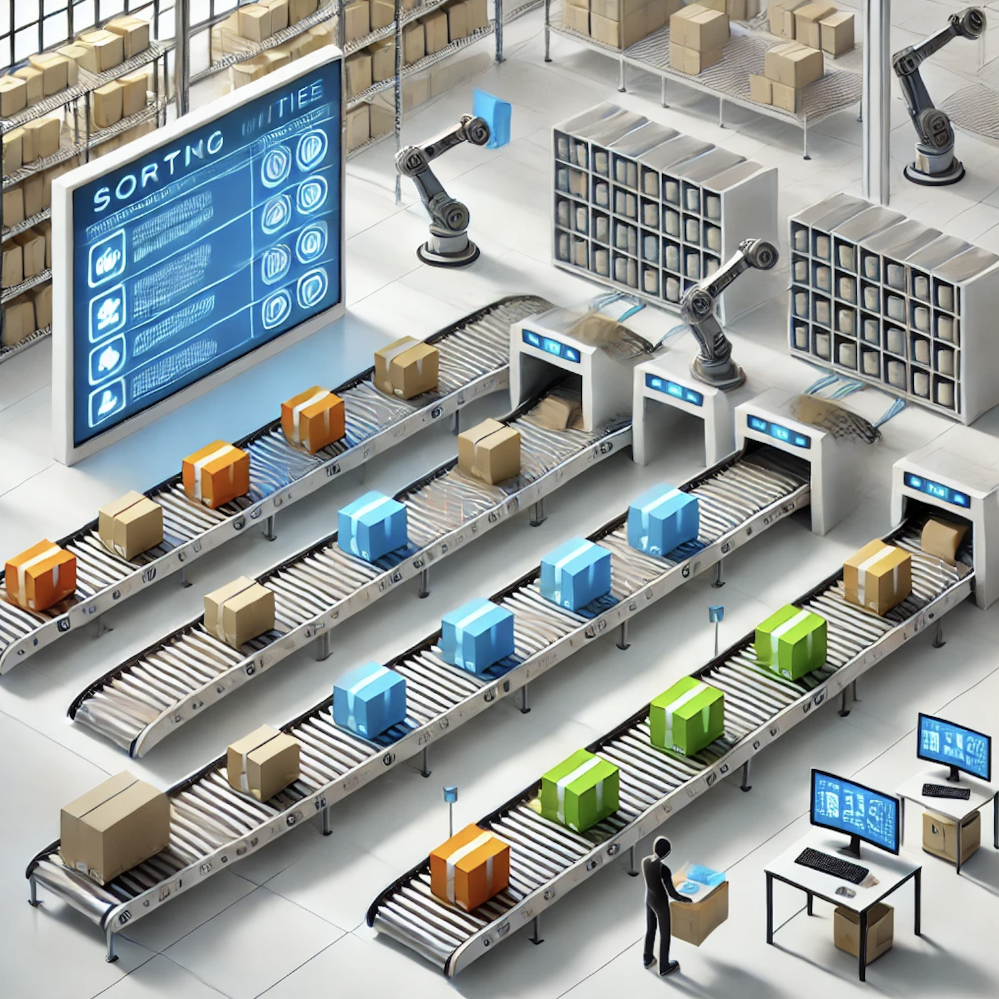

## 📦 Inventory Sorting System  

### **Problem Statement**  
You are managing an **inventory** in a warehouse, where items belong to exactly **three distinct categories**. The inventory is represented as an array of item IDs, and a **priority list** specifies the order in which items should be arranged for shipment.  

Your task is to **rearrange the inventory in-place** so that items appear in the same order as given in the priority list. You must accomplish this in **O(N) time** and **O(1) auxiliary space**.  


### **Function Signature**  
```python
def sort_inventory(inventory: List[int], priority: List[int]) -> List[int]:
```

### **Constraints**  
- The `inventory` **only contains** item IDs found in the `priority` list.  
- The order in `priority` **is fixed** and must be respected in the sorted `inventory`.  
- You **must not use extra memory** beyond a few variables (**O(1) space**).  
- Your solution **should run in O(N) time**.  

---

### **Example 1**  
#### **Input:**  
```python
inventory = [2, 0, 0, 3, 3, 0, 2, 2]
priority = [0, 2, 3]
```
#### **Output:**  
```python
[0, 0, 0, 2, 2, 2, 3, 3]
```
---

### **Example 2**  
#### **Input:**  
```python
inventory = [5, 4, 5, 6, 6, 4, 5, 6, 4]
priority = [4, 5, 6]
```
#### **Output:**  
```python
[4, 4, 4, 5, 5, 5, 6, 6, 6]
```
---

### **Example 3**  
#### **Input:**  
```python
inventory = [3, 1, 2, 3, 2, 1, 1, 3, 2]
priority = [1, 2, 3]
```
#### **Output:**  
```python
[1, 1, 1, 2, 2, 2, 3, 3, 3]
```


[🎵 Coding Music Playlist](https://youtu.be/xAR6N9N8e6U?si=lpoAhtiYOdgH7wpm)
