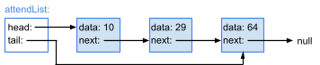

# Project 0: Single Linked Lists - Iterative

**PLEASE NOTE THAT THIS PROJECT IS NOT WORTH ANY POINTS , ALL MANUAL AND AUTO GRADED POINTS LEFT TO SHOW YOU HOW WOULD THAT LOOK LIKE IN ACTUAL PROJECT**
**Due: Thursday, XXXX**

Assignment Overview
---------------

A **Singly Linked List (SLL)** is a linear collection of elements, whose order is given by references stored in each element (also known as **nodes**).
This project will explore implementing a singly linked list using iterative methods.The Singly linked list in this project contains reference to Head and Tail.

Elements in linked lists are not stored contiguously (in one block) in memory. This enables much faster insertion and deletion (especially at the front) than is available for typical arrays, and makes linked lists ideal for implementing other structures such as queues or deques (pronounced 'decks'). In some cases, large datasets may outgrow what is continuously available at a given time, making the use of standard arrays impossible.

This non-contiguous memory allocation comes with a price, however: linked lists are unable to take advantage of indexing, and elements are only accessible by traversing the list until they are found.

For more information on Singly Linked Lists, please visit [Zybooks Chapter 20](https://learn.zybooks.com/zybook/MSUCSE331OnsayFall2023/chapter/20/section/2).

---------------

* Time complexity accounts for 30% of the points on Project 1. 
Be sure to review the rubric and adhere to complexity requirements!
* Docstrings (the multi-line comments beneath each function header) are provided in Project 1 to serve as an example for future reference. In future projects, docstrings will **not** be provided, and will need to be completed for full credit.
* Test cases are your friend: before asking about what the form of input/output is or what happens in a particular edge case, check to see if the test cases answer your question for you. By showing the expected output in response to each input, they supplement the specs provided here.
* Don't be afraid to debug your code using PyCharm. Here are a couple useful short videos posted for you on D2L to learn how to debug while unit testing.
  * [See Example 1 Using PyCharm debugger demonstrating on Project 0](https://youtu.be/TDGLfIDPWUQ)
  * [See Example 2 Using PyCharm debugger demonstrating on Merge Sort](https://mediaspace.msu.edu/media/Download+-Debug-Run-Recursive+Algorithm+such+as+Merge+Sort/1_eadriksh)
* Debugging will help you figure out where you're going wrong far more quickly than ad-hoc print statements!
* For more information on how to debug your code using PyCharm, please go to D2L, under Course Tools, and you will find very useful tutorial videos under this module.

* We **strongly** encourage you to avoid calling `delete` in `delete_all`. Why? It's far less efficient to repeatedly call `delete`, as each call to `delete` begins searching at the beginning of the list. In the worst case, this will lead our function to operate with O(n^2) time complexity, **violating the required time complexity.**
* In the test cases for this project, you will notice the use of `assertEqual` and `assertIs`. What's the difference? It ties back to the difference between `==` and `is` in Python. 

The double-equal sign compares _values_ in Python, while the `is` operator compares _memory addresses_ in Python. Put simply, the `is` keyword is stronger than `==`: if two objects are at the same memory address, they must contain the same value. However, it is possible for two objects _not_ at the same memory address to have the same value. In other words, if `a is b` then we know `a == b` as well, but if `a == b` we cannot conclude `a is b`. A great read on the subject is [available here](https://realpython.com/courses/python-is-identity-vs-equality/).
* A few notes on grading:
    *   **All of your functions must be iterative.** You will lose **all** points related to the function if it uses recursion! 
    *   **Do not use additional data structures**, such as lists or strings, unless specified otherwise. You will lose **all** points relating to the function if you do.
    *   In addition to the Codio testing, you will also be graded on the **time** performance of your functions. Take note of the time complexity requirement for each function.
    *   **No hard-coding** **testcases**. If you practice hard coding, you will lose **all** points for that function.

Assignment Specifications
-------------------------

### **class SLLNode:**

_**Do not modify** this class_

*   **Attributes:**
    *   **data**: Data stored in a Node
    *   **next**: Reference to the following Node (can be None)
*   **init(self, data : T, next: Node = None) -> None:**
    *   This function initializes a node with the given data and next reference, where `next` points to the next Node in the list.
    *   self.data - The data held by the Node
    *   self.next - The next Node in the list, with a default value of `None`
*   **repr(self) -> str:**
    *   A node is represented in string form as 'data'
*   **str(self) -> str:**
    *   A node is represented in string form as 'data'. Use str(node) to make it a string.
*   **eq(self, other: Node) -> bool:**
    * This function compares two Nodes.
    * other - The right-hand operand of the "=="
    * Returns True if the Nodes are the same, else False

### **class SinglyLinkedList:**

_**Do not modify** the following attributes/methods_

*   **Attributes:**
    *   **head:** The first Node in the linked list (May be None)
    *   **tail:** The last Node in the linked list (May be None)
*   **init(self) -> None:**
    *   This function initializes a SinglyLinkedList
*   **repr(self) -> str:**
    * A string representation of the list.
    * For this to work, you must have completed to\_string
*   **eq(self, other:SLL) -> bool:**
    *   This function compares two SinglyLinkedLists.
    *   other - The right-hand operand of the "=="
    *   Returns True if the lists are the same, else False

You must implement the following functions in **solution.py**. Take note of the specified return values, input parameters, and time complexity requirements. **Do not change the function signatures.**

*   **append(self, data: T) -> None:**
    *   Insert the given **data** into the linked list
    *   The data should be inserted at the end of the list
    *   NOTE: This function must work in order to do the rest of the project!!!
    * Time complexity: _O(n)_ is accepted _O(1)_ is encouraged.
*   **to\_string(self) -> str:**
    *   Generate and return a string representation of the list
    *   The values should be separated by " --> " (a space, then two hyphens, a greater-than symbol, then another space)
        *   Make sure to avoid a trailing " --> "!
    *   Return the string "None" if there are no nodes in the list.
    *   **You are allowed to use strings in this function.**
    *   Time Complexity: _O(n)_, assuming string concatenation method is _O(1)_
        * See this [link](https://codereview.stackexchange.com/questions/3972/string-manipulation-complexity/3973#3973) (refers to Java, but the same idea applies in Python) for more information as to why string concatenation is, in general, NOT O(1)
*   **length(self) -> int:**
    *   Determines the number of nodes in the list
    *   If the list is empty, it has a length of 0.
    *   Time complexity: _O(n)_
*   **total(self) -> T:**
    *   Calculates and returns the sum total of the values in the list, assuming all values in the list are of the same type T
    *   If the list is empty, return None.
    *   Note that this function must work with any type T, whether T is an integer, a string, or some other class you don't yet know about. How can you get the starting value of the correct type for your total?
    *   Time complexity: _O(n)_, assuming the addition operation is _O(1)_
*   **delete(self, data: T) -> bool:**
    *   Delete the _first_ node in the list with the given **data**
    *   If the data doesn't exist in the list, do not change the linked list
    *   Return True if anything was successfully deleted, else False
    *   Time complexity: _O(n)_
*   **delete\_all(self, data: T) -> bool:**
    *   Deletes all nodes in the list with the given **data**
    *   If the data doesn't exist in the list, do not change the linked list
    *   Return True if anything was successfully deleted, else False
    *   Again, it is highly recommended that you avoid calling `delete` in this function
    *   Time complexity: _O(n)_
*   **find(self, data: T) -> bool:**
    *   Looks for **data** in the list
    *   Returns True if the data is in the list, else False
    *   Time complexity: _O(n)_
*   **find\_sum(self, data: T) -> bool:**
    *   Counts and returns how many times the given **data** occurs in the list
    *   Time complexity: _O(n)_

**IMPORTANT** Please note that the functions with type T must work with any type T, whether T is an integer, a string, etc. You must prevent any **hard-coding** for each type like using 'isinstance' or type functions to determine if the node uses strings or integers. You must make sure that your algorithm is generalizable and not just a one-to-one mapping of the test cases. One the reasons why we learn and use OOP languages is writing reusable programs :)

**Application Problem:**
------------------------

In this application problem, your good friend Mario "Jumpman" Mario has reached out to you for some help. You see, Bowser challenged him and his friends to a kart-racing tournament. Bowser got to set up the rosters of racers, but Mario heard from some spies on the inside that Bowser plans to rig the starting line! To keep things fair, Mario is allowed to rearrange the rosters, as long as he keeps the same relative order. He needs to update the rosters so his allies on the course can hit the road before Bowser's traps! Unfortunately, Mario didn't pay too much attention when his CSE331 class went over singly linked lists, and Bowser chose that data structure to organize the rosters. Mario remembered how hard you worked in that class, and he needs your help now to ensure a fair game in this tournament!

To do this, you will implement one function:

*   **help\_mario(roster: SLL, ally: str) -> bool**
    *   Given a linked list **roster** and a string **ally**, update the linked list _in place_ so **ally** is at the head, with the relative ordering before and after remaining the same (See examples below)
    *   Returns `True` if **roster** was changed, else `False`
    *   **You may not use any additional data structures in this function - this includes python lists, dictionaries, and sets!**
    *   Time complexity : _O(n)_

### **Examples:**

Ex1.

roster = Luigi --> King Boo --> Toad --> Morton Koopa Jr.

ally = Yoshi

Returns: False. **roster** is still: Luigi --> King Boo --> Toad --> Morton Koopa Jr.

Explanation: Since the specified **ally** was not in the roster, it did not need to be changed.

Ex2.

roster = Luigi --> King Boo --> Toad --> Morton Koopa Jr.

ally = Luigi

Returns: False. **roster** is still: Luigi --> King Boo --> Toad --> Morton Koopa Jr.

Explanation: Since the specified **ally** was already first on the roster, it did not need to be changed.

Ex3.

roster = Luigi --> King Boo --> Toad --> Morton Koopa Jr.

ally = Toad

Returns: True. **roster** is now: Toad --> Morton Koopa Jr. --> Luigi --> King Boo

Explanation: Since the specified **ally** was not first on the roster, he needed to be moved to first. All the allies after him still went directly after him, and the allies before him went after _that_, preserving the relative order. Since King Boo went before Toad (the **ally**) originally, he now goes last. 

Ex4.

roster = Wario --> Diddy Kong --> Waluigi --> Rosalina --> Dry Bones

ally = Rosalina

Returns: True. **roster** is now: Rosalina --> Dry Bones --> Wario --> Diddy Kong --> Waluigi

Explanation: Since the specified ally was not first, the roster needed to be updated accordingly. Since Waluigi directly preceded Rosalina (the **ally**) in the original list, he now goes last, preserving the relative order.

# **Submission Guidelines**

### **Deliverables:**

For each project, a `solution.py` file will be provided. Ensure to write your Python code within this file. For best results:
- 📥 **Download** both `solution.py` and `tests.py` to your local machine.
- 🛠️ Use **PyCharm** for a smoother coding and debugging experience.

### **How to Work on a Project Locally:**

Choose one of the two methods below:

#### **APPROACH 1: Using D2L for Starter Package**
1. 🖥️ Ensure PyCharm is installed.
2. 📦 **Download** the starter package from the *Projects* tab on D2L. *(See the tutorial video on D2L if needed)*.
3. 📝 Write your code and, once ready, 📤 **upload** your `solution.py` to Codio. *(Refer to the D2L tutorial video for help)*.

---

#### **APPROACH 2: Directly from Codio**
1. 📁 On your PC, create a local folder like `Project01`.
2. 📥 **Download** `solution.py` from Codio.
3. 📥 **Download** `tests.py` from Codio for testing purposes.
4. 🛠️ Use PyCharm for coding.
5. 📤 **Upload** the `solution.py` back to Codio after ensuring the existing file is renamed or deleted.
6. 🔚 Scroll to the end in Codio's Guide editor and click the **Submit** button.

---

### **Important:**
- Always **upload** your solution and **click** the 'Submit' button as directed.
- All project submissions are due on Codio. **Any submission after its deadline is subject to late penalties** .
  
**Tip:** While Codio can be used, we recommend working locally for a superior debugging experience in PyCharm. Aim to finalize your project locally before submitting on Codio.

### Deliverables:

Please submit your solution.py  

**Grading**

* Tests (70 points)
    * 01 - test\_append: \_\_/4
    * 02 - test\_to\_string: \_\_/3
    * 03 - test\_length: \_\_/3
    * 04 - test\_total: \_\_/4
    * 05 - test\_find: \_\_/10
    * 06 - test\_find\_sum: \_\_/10
    * 07 - test\_delete: \_\_/8
    * 08 - test\_delete\_all: \_\_/8
    * 09 - test\_help\_mario: \_\_/20

* Manual (30 points)
  * Time  complexity points are **all-or-nothing** for each function. If you fail to meet time in a given function, you do not receive manual points for that function.
  * If a function does not pass its associated test cases, you will not receive manual points for that function.
  * Loss of 1 point per missing docstring (max 5 point loss)
  * Loss of 2 points per changed function signature (max 20 point loss)
  
**Note on Comprehensive Testing:**

We have included a comprehensive test for each function, which is worth 0 points. We **strongly recommend** you to utilize these tests as they are designed to thoroughly check your functions for any logical flaws. While these tests do not directly contribute to your score, if your solution fails to pass a comprehensive test for a specific function during our assessment, **half of the manual points allocated for that function will be deducted**. This is to emphasize the importance of not only meeting basic requirements but also ensuring robustness and correctness in your code. Consider these comprehensive tests as tools for ensuring quality and resilience in your solutions.

---
  * **You may not use any additional data structures other than linked lists in this function - this includes no python lists, dictionaries, and sets!**
  * M1 - test\_append: \_\_/3
  * M2 - test\_to\_string: \_\_/2
  * M3 - test\_length: \_\_/2
  * M4 - test\_total: \_\_/2
  * M5 - test\_find: \_\_/2
  * M6 - test\_find_sum: \_\_/2
  * M7 - test\_delete: \_\_/3
  * M8 - test\_delete\_all: \_\_/4
  * M9 - test\_help\_mario: \_\_/8
  * M10 - test\_feedback and citation: \_\_/2

* **DOCSTRINGS** are provided for this project. Please note that, in future projects, failure to write DOCSTRINGS will result in deductions! Use this project as a template for your DOCSTRINGS on future projects. To learn more on what a DOCSTRING is, visit the following website: [What is a Docstring?](https://peps.python.org/pep-0257/)
    * One point per function that is missing a DOCSTRING
    * Up to 5 points of deductions

Created by Lauren Garvey

