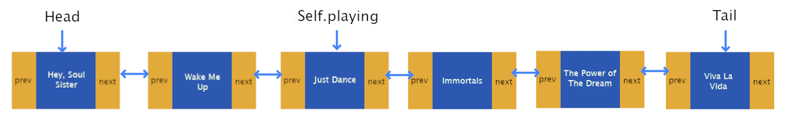
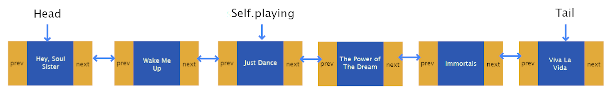
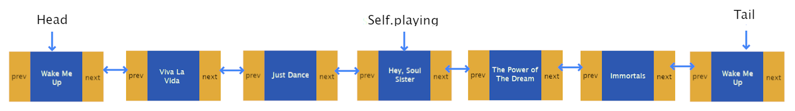
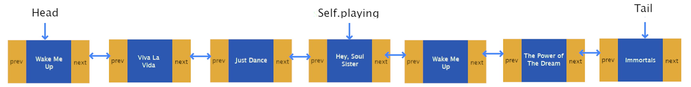
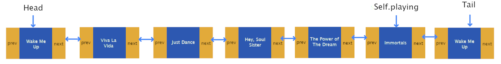
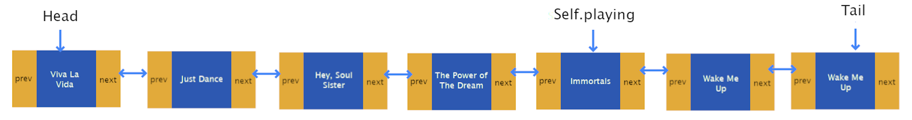
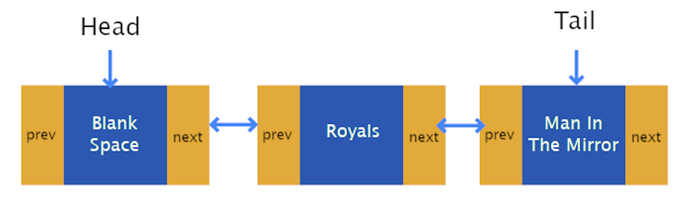
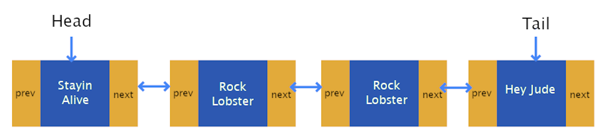
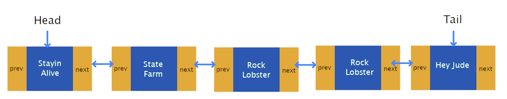

# Project 1: Doubly Linked Lists

**Due: Friday, January 31th at 9:00 PM EST**

_This is not a team project. Do not copy someone else’s work._

# Assignment Overview

Doubly linked lists (DLLs) are a fundamental data structure used to store sequential information. DLLs consist of a chain of _nodes_ linked to one another by _forward_ and _backward_ references, such that one may traverse the chain from the _head_ to the _tail_, or vice-versa. Each node stores a _value_, which may be a number, string, or more complex object.

Traditional _arrays_ provide a simpler means for storing sequential information, but come with a major drawback which DLLs avoid: arrays require contiguous blocks of memory, while DLLs may utilize memory wherever it is available. In settings where data is updated, manipulated or deleted frequently, DLLs outperform traditional arrays by avoiding the need for memory reallocation. [This article](https://www.geeksforgeeks.org/linked-list-vs-array/) gives a nice overview of the distinction between DLLs and arrays.

Also see Zybooks Chapter 20 if you need further review of DLL.

# Assignment Notes

1. Time **and** space complexity account for 30% of the points on Project 1. Be sure to review the rubric and adhere to complexity requirements!
2. Docstrings (the multi-line comments beneath each function header) are provided in Project 1 to serve as an example for future reference. In future projects, docstrings will not be provided, and will need to be completed by you for full credit.
3. Testcases are your friend: before asking about the form of input/output or what happens in a particular edge case, check to see if the test cases answer your question for you. By showing the expected output in response to each input, they supplement the specs provided here.
4. Don't be afraid to go to D2L Course Tools for tutorial videos on how to debug, it will help you figure out where you're going wrong far more quickly than ad-hoc print statements!
5. Throughout the specs, we mention Python double-underscore "magic" methods. These are central to the structure of object-oriented programming in Python, and will continue to appear in future projects in CSE 331 and beyond. [This page](https://rszalski.github.io/magicmethods/) is a great reference if you'd like to learn more about how they work!
6. There are two functions which may seem a little odd to you _\_find_nodes_ and _remove_node_. These functions are intended as helper functions to help you reuse code and allow you to practice writing modular code.
7. We **strongly** encourage you to avoid calling `remove` in `remove_all`. Why? It's far less efficient to repeatedly call `remove`, as each call to remove begins searching at the beginning of the list. In the worst case, this will lead our function to operate with O(n^2) time complexity, **violating the required time complexity.**
8. We **strongly** encourage you to implement reverse in-place, without creating any new Node objects and instead rearranging prev and next pointers. Why? It's far less efficient to rebuild the DLL than it is to simply adjust references, as it's far more work to construct a brand new Node object than it is to simply adjust an existing one's references.
9. In the testcases for this project, you will notice the use of assertEqual and assertIs. What's the difference? It ties back to the difference between == and is in Python. The double-equal sign compares _values_ in Python, while the is operator compares _memory addresses_ in Python. Put simply, the is keyword is stronger than ==: if two objects are at the same memory address, they must contain the same value. However, it is possible for two objects _not_ at the same memory address to have the same value. In other words, if a is b then we know a == b as well, but if a == b we cannot conclude a is b. A great read on the subject is [available here](https://realpython.com/courses/python-is-identity-vs-equality/).

### **Auxiliary Space Complexity: An Overview**

Auxiliary space complexity refers to the amount of additional space, aside from the input, that an algorithm or a method requires to execute. This is especially important when evaluating the efficiency of algorithms. It's different from the space complexity in that it doesn't consider the space required by the inputs; instead, it looks only at the extra space (temporary space) taken up, typically for variables, temporary structures, etc.

# Assignment Specifications

**class Node:**

A class that implements the nodes to be created for a DLL.

_DO NOT MODIFY the following attributes/functions_

- **Attributes**
  - **value: T:** Value held by the Node. Note that this may be any type, such as a str, int, float, dict, or a more complex object.
  - **next: Node:** Reference to the next Node in the linked list (may be None).
  - **prev: Node:** Reference to the previous Node in the linked list (may be None).
- **\_\_init\_\_(self, value: T, next: Node = None, prev: Node = None) -> None**
  - Constructs a doubly linked list node.
  - **value: T:** Value held by the Node.
  - **next: Node:** Reference to the next Node in the linked list (may be None).
  - **prev: Node:** Reference to the previous Node in the linked list (may be None).
  - **Returns:** None.
- **\_\_str\_\_(self) -> str** and **\_\_repr\_\_(self) -> str**
  - Represents the Node as a string.
  - Note that Python will automatically invoke this function when using printing a Node to the console, and PyCharm will automatically invoke this function when displaying a Node in the debugger.
  - As with all double-underscore "magic" methods in Python (see note 5), this function may be called with str(node) or repr(node). It is not necessary (and stylistically improper) to use node.\_\_str\_\_() or node.\_\_repr\_\_(), just as it is preferable to call len(some_list) instead of some_list.\_\_len\_\_().
  - **Returns:** str.

**class DLL:**

A class that implements the doubly linked list with previous and forward references.

_DO NOT MODIFY the following attributes/functions_

- **Attributes**
  - **head: Node:** Head (first node) of the doubly linked list (may be None).
  - **tail: Node:** Tail (last node) of the doubly linked list (may be None).
  - **size: int:** Number of nodes in the doubly linked list.
  - Note that the implementation in this project does not use a [sentinel node](https://en.wikipedia.org/wiki/Sentinel_node). As such, an empty DLL will have head and tail attributes which are None.
- **\_\_init\_\_(self) -> None**
  - Construct an empty DLL. Initialize the head and tail to None, and set the size to zero.
  - **Returns:** None.
- **\_\_str\_\_(self) -> str** and **\_\_repr\_\_(self) -> str**
  - Represents the DLL as a string of the form "value <-> value <-> ... <-> value."
  - Note that Python will automatically invoke this function when printing a DLL to the console, and PyCharm will automatically invoke this function when displaying a DLL in the debugger.
  - As with all double-underscore "magic" methods in Python (see note 5), this function may be called with str(dll) or repr(dll). It is not necessary (and stylistically improper) to use dll.\_\_str\_\_() or dll.\_\_repr\_\_(), just as it is preferable to call len(some_list) instead of some_list.\_\_len\_\_().
  - **Returns:** str.

_IMPLEMENT the following functions_

- **empty(self) -> bool**
  - Returns a boolean indicating whether the DLL is empty.
  - _Required time complexity:_ O(1).
  - _Required space complexity:_ O(1).
  - **Returns:** True if DLL is empty, else False.
  - Since this method is simply checking if the doubly linked list (DLL) is empty (likely by verifying if the head of the list is `None` or if the size of the list is 0), its space complexity is O(1). 
- **push(self, val: T, back: bool = True) -> None**
  - Adds a Node containing val to the back (or front) of the DLL and updates size accordingly.
  - _Required time complexity:_ O(1).
  - _Required space complexity:_ O(1).
  - **val: T:** Value to be added to the DLL.
  - **back: bool:** If True, add val to the back of the DLL. If False, add to the front. Note that the default value is True.
  - **Returns:** None.
  - The act of pushing a value onto a DLL involves creating a new node and adjusting a couple of pointers (previous and next). It doesn't matter how long the DLL is; the process of adding a node requires a fixed amount of space. Hence, its space complexity remains `O(1)`.
- **pop(self, back: bool = True) -> None**
  - Removes a Node from the back (or front) of the DLL and updates size accordingly.
  - In the case that the DLL is empty, pop does nothing.
  - _Required time complexity:_ O(1).
  - _Required space complexity:_ O(1).
  - **back: bool:** If True, remove from the back of the DLL. If False, remove from the front. Note that the default value is True.
  - **Returns:** None.
  - Popping a value from the DLL involves adjusting pointers and, in some implementations, deallocating the node's memory. Like the push method, the space it requires doesn't depend on the size of the DLL. Therefore, its space complexity is `O(1)`.
- **list_to_dll(self, source: list[T]) -> None**
  - Creates a DLL from a standard Python list. If there are already nodes in the DLL, the DLL should be cleared and replaced by **source**.
  - Hint: clearing the DLL can be very simple. Think about what an empty DLL looks like (what are the values of head and tail?).
  - _Required time complexity:_ O(n).
  - _Required space complexity:_ O(n).
  - **source: list[T]:** Standard Python list from which to construct DLL.
  - **Returns:** None.
  - When transforming a standard Python list into a DLL, the method will likely iterate over each item in the source list and create a new node in the DLL. The number of nodes created will be proportional to the size of the source list. Thus, in the worst-case scenario, if the source list contains 'n' elements, the method will require space for 'n' nodes. Hence, its space complexity is `O(n)`, meaning it requires linear space relative to the size of the input list.
- **dll_to_list(self) -> list[T]**
  - Creates a standard Python list from a DLL.
  - _Required time complexity:_ O(n).
  - _Required space complexity:_ O(n).
  - **Returns:** list[T] containing the values of the nodes in the DLL.
- **\_find_nodes(self, val: T, find_first: bool =False) -> List[Node]:**
  - Construct list of Node with value val in the DLL and returns the associated Node object list
  - _Required time complexity:_ O(n).
  - _Required space complexity:_ O(n).
  - MUST BE CALLED FROM find AND find_all
    - If find and find_all do not call \_find_nodes, **all testcase and manual points** for find and find_all will be forfeited.
  - Will not be tested explicitly
    - Tests for find and find_all will ensure functionality
  - **val: T:** Value to be found in the DLL.
  - **find_first: bool:** if True find only the first element in the DLL, it false find all instances of the elements in the DLL.
  - **Returns:** list of Node objects in the DLL whose value is val. If val does not exist in the DLL, returns empty list.
- **find(self, val: T) -> Node**
  - Finds first Node with value val in the DLL and returns the associated Node object.
  - _Requires call to_ \_find_nodes
    - Failure to call \_find_nodes will result in **all testcase and manual points** being forfeited for find.
  - _Required time complexity:_ O(n).
  - _Required space complexity:_ O(1).
  - **val: T:** Value to be found in the DLL.
  - **Returns:** first Node object in the DLL whose value is val. If val does not exist in the DLL, return None.
- **find_all(self, val: T) -> list[Node]**
  - Finds all Node objects with value val in the DLL and returns a standard Python list of the associated Node objects.
  - _Requires call to_ `_find_nodes`
    - Failure to call `_find_nodes` will result in **all testcase and manual points** being forfeited for find_all.
  - _Required time complexity:_ O(n).
  - _Required space complexity:_ O(n).
  - **val: T:** Value to be found in the DLL.
  - **Returns:** standard Python list of all Node objects in the DLL whose value is val. If val does not exist in the DLL, returns an empty list.
- **remove_node(self, to_remove: Node) -> None**
  - Given a reference to a node in the linked list, remove it
  - MUST BE CALLED FROM `remove` AND `remove_all`
  - Will not be tested explicitly
    - Tests for remove and remove_all will ensure functionality
  - _Required time complexity:_ O(1).
  - _Required space complexity:_ O(1).
  - **to_remove: Node:** Node to be removed from the DLL.
  - **Returns:** None.
- **remove(self, val: T) -> bool**
  - removes first Node with value val in the DLL.
  - MUST CALL `remove_node`
    - Failure to call `remove_node` will result in **all testcase and manual points** being forfeited for remove.
  - Hint
    - Use of `find` allows this to be implemented in less than 10 lines.
  - _Required time complexity:_ O(n).
  - _Required space complexity:_ O(1).
  - **val: T:** Value to be removed from the DLL.
  - **Returns:** True if a Node with value val was found and removed from the DLL, else False.
- **remove_all(self, val: T) -> int**
  - removes all Node objects with value val in the DLL. See note 7.
  - MUST CALL `remove_node`
    - Failure to call `remove_node` will result in **all testcase and manual points** being forfeited for remove_all.
  - Hint
    - Use of `find_all` allows this to be implemented in less than 10 lines.
  - _Required time complexity:_ O(n).
  - _Required space complexity:_ O(n).
  - **val: T:** Value to be removed from the DLL.
  - **Returns:** number of Node objects with value val removed from the DLL. If no node containing val exists in the DLL, returns 0.
- **reverse(self) -> None**
  - Reverses the DLL in-place by modifying all next and prev references of Node objects in DLL. Updates self.head and self.tail accordingly. See note 8.
  - _Required time complexity:_ O(n).
  - _Required space complexity:_ O(1).
  - **Returns:** None.

# Application Problem: Spotify

Spotify came to everyone's life as a saviour, no more having to wait for a download on 4shared to finish in order to listen to a song you like, or having to buy it on Itunes. Your friend also really likes it, but he has become annoyed with always having to scramble with the queue in order to listen to his favorite songs, so he has come to you, the master of computers. You are tasked with helping him to make his life easier using your tech-skills.

The goal of this function is to simulate the reordering of certain songs within a music playlist.

## Function Description

**class Spotify_Music_Player:**

- **\_\_init\_\_(self, paid: bool=False) -> None**
- **Attributes**
  - self.songlist - a DLL containing songs. The DLL represents the order musics are to be played in. Any musics before the node `self.playing` have already been played.
  - self.playing - the node containing the song currently being played
  - self.paid - a bool indicating if the user has paid for ad blocking
  - _Required time complexity:_ O(1).
  - _Auxiliary space complexity:_ O(1).
  - **Returns:** None

\_IMPLEMENT the following class and class method

- **def play_favorite_next(self, favorite_song, forward=True) -> None**
  - This function moves the node from the queue containing `favorite_song` to be played after the current song. If the song is not in the queue, a node is added after the current song.
  - **favorite_song: str:** The next song to be played after self.playing.
  - **forward: bool:** This tells you where to remove the favorite song node from, in order to move it after the currently playing song, if already in the song list. If True, remove the latest node in the list that contains the favorite song. If False, remove the first occurence of favorite song and move it to be after the playing node.
  - Note that the song currently being played isn't always the head of the song list.
  - _Required time complexity:_ O(N).
  - _Auxiliary space complexity:_ O(N).
  - **Returns:** None

## **play_favorite_next**

## **Example 1**

Before:

Favorite song = "The Power of The Dream", Currently Playing = "Just Dance", Forward = True

 Node(Wake Me Up) <-> Node(Just Dance) <-> Node(Immortals) <-> Node(The Power of The Dream) <-> Node(Viva la Vida)"/>

After:
 Node(Wake Me Up) <-> Node(Just Dance) <-> Node(The Power of The Dream) <-> Node(Immortals) <-> Node(Viva la Vida)"/>

Notice now the song "The Power of The Dream" is after the currently being played song "Just Dance"

## **Example 2**

Before:

Favorite Song = "Wake Me Up", Currently Playing = "Hey, Soul Sister", Forward = True

 Node(Viva la Vida) <-> Node(Just Dance) <-> Node(Hey, Soul Sister) <-> Node(The Power of The Dream) <-> Node(Immortals) <-> Node(Wake Me Up)"/>

After:
 Node(Viva la Vida) <-> Node(Just Dance) <-> Node(Hey, Soul Sister) <-> Node(Wake Me Up) <-> Node(The Power of The Dream) <-> Node(Immortals)"/>

Notice how the second "Wake Me Up" (the tail) is the one that changes since the direction we are told to traverse is by going forward or next in the queue

## **Example 3**

Before:

Favorite Song = "Wake Me Up",
Currently Playing = "Immortals",
Forward = False

 Node(Viva la Vida) <-> Node(Just Dance) <-> Node(Hey, Soul Sister) <-> Node(The Power of The Dream) <-> Node(Immortals) <-> Node(Wake Me Up)"/>

After:
 Node(Just Dance) <-> Node(Hey, Soul Sister) <-> Node(The Power of The Dream) <-> Node(Immortals) <-> Node(Wake Me Up) <-> Node(Wake Me Up)"/>

Notice how the first occurance of "Wake Me Up" (the head) is the one that changes since Forward = False

## One more thing...

Wow! Spotify was impressed with your skills after they saw what you did, now they want you to help them solve a BIG problem: ads. For whichever customers that don't pay for the premium plan, you need to find the ideal place to play ads in order to maximize engagement on the app!

You will do so by implementing the following function on the class `Spotify_Music_Player`:

**def add_ads(self, advertisement: str, favorite: str) ->None:**

- This function is responsible for adding all the necessary ads in order for Spotify to make their money. Ads are to come
  before a user's favorite song but not after it. Before every node that contains the favorite song, and is not right after a favorite song node, add a new node with the value of the advertisement.
- A user is considered to be in the premium subscription if the `self.paid` attribute is True. In this case, there is no need to change anything.
- For this function the `playing` attribute is not relevant.
- **advertisement : str :** a string with the name of the ad to add
- **favorite: str :** a string containing the name of the song the user loves to listen to
- _Required time complexity:_ O(N).
- _Auxiliary space complexity:_ O(1).
- **Returns:** None

## **add_ads**

## **Example 1**

Paid Subcription:

Paid = `True`

Before:

 Node(Royals) <-> Node(Man in the Mirror)"/>

After:

 Node(Royals) <-> Node(Man in the Mirror)"/>
Notice there are no additional ads in the playlist since they paid for ad blocking

## **Example 2**

Ad = "State Farm"
Favorite Song = "Rock Lobster"

Before:

 Node(Rock Lobster) <-> Node(Rock Lobster) <-> Node(Hey Jude)"/>

After:

 Node(State Farm) <-> Node(Rock Lobster) <-> Node(Rock Lobster) <-> Node(Hey Jude)"/>

Notice how despite there being two songs that are favorited, only one ad appears since this is how may can correctly appear due to the rules of ads.

## **Submission**

#### **Deliverables**

## **Submission Guidelines**

### **Deliverables:**

For each project, a `solution.py` file will be provided. Ensure to write your Python code within this file. For best results:

- 📥 **Download** both `solution.py` and `tests.py` to your local machine.
- 🛠️ Use **PyCharm** for a smoother coding and debugging experience.

### **How to Work on a Project Locally:**

Choose one of the two methods below:

---

#### **APPROACH 1: Using D2L for Starter Package**

1. 🖥️ Ensure PyCharm is installed.
2. 📦 **Download** the starter package from the _Projects_ tab on D2L. _(See the tutorial video on D2L if needed)_.
3. 📝 Write your code and, once ready, 📤 **upload** your `solution.py` to Codio. _(Refer to the D2L tutorial video for help)_.

---

#### **APPROACH 2: Directly from Codio**

1. 📁 On your PC, create a local folder like `Project01`.
2. 📥 **Download** `solution.py` from Codio.
3. 📥 **Download** `tests.py` from Codio for testing purposes.
4. 🛠️ Use PyCharm for coding.
5. 📤 **Upload** the `solution.py` back to Codio after ensuring the existing file is renamed or deleted.
6. 🔚 Scroll to the end in Codio's Guide editor and click the **Submit** button.

---

### **Important:**

- Always **upload** your solution and **click** the 'Submit' button as directed.
- All project submissions are due on Codio. **Any submission after its deadline is subject to late penalties** .

**Tip:** While Codio can be used, we recommend working locally for a superior debugging experience in PyCharm. Aim to finalize your project locally before submitting on Codio.

### **Important:**

- Always **upload** your solution and **click** the 'Submit' button as directed.
- All project submissions are due on Codio. **Any submission after its deadline (Thursday, January 25th, 2023 at 9:00 PM EST) is subject to late penalties** .

**Tip:** While Codio can be used, we recommend working locally for a superior debugging experience in PyCharm. Aim to finalize your project locally before submitting on Codio.

**Grading**

The application problem test cases, include test_get_current_url, test_visit, test_backward, test_forward, test_malicious_sites. The first four get the basic browser history functionality working and then the last malicious sites test case gets the special skipover working.

- **Auto Graded Tests (70 points)** see below for the point distribution for the auto graded tests:

  - 01 - test_empty: \_\_/5
  - 02 - test_push: \_\_/5
  - 03 - test_pop: \_\_/5
  - 04 - test_list_to_dll: \_\_/5
  - 05 - test_dll_to_list: \_\_/5
  - 06 - test_find: \_\_/7
  - 07 - test_find_all: \_\_/7
  - 08 - test_remove: \_\_/7
  - 09 - test_remove_all: \_\_/7
  - 10 - test_reverse: \_\_/7
  - 11 - test_play_favorite_song: \_\_/5
  - 12 - test_add_ads: \_\_/5

- **Manual (30 points)**

  - Time and Space complexity points are **divided equally** for each function. If you fail to meet time **or** space complexity in a given function, you receive half of the manual points for that function.
  - Loss of 1 point per missing docstring (max 5 point loss)
  - Loss of 2 points per changed function signature (max 20 point loss)
  - Loss of complexity and loss of testcase points for the required functions in this project. You may not use any additional data structures such as dictionaries, and sets!”

  - M1 - test_empty: \_\_/2
  - M2 - test_push: \_\_/2
  - M3 - test_pop: \_\_/2
  - M4 - test_list_to_dll: \_\_/2
  - M5 - test_dll_to_list: \_\_/2
  - M6 - test_find_nodes: \_\_/2
    - If find and find_all do not call \_find_nodes, **all testcase and manual points** for find and find_all will be forfeited.
    - If \_find_nodes violates time and/or space complexity and is called by find and find_all (as it must be), **all manual points** will be forfeited for the three functions
  - M7 - test_find: \_\_/2
  - M8 - test_find_all: \_\_/2
  - M9 - test_remove_node: \_\_/2
    - If remove and remove_all do not call \_remove_node, **all testcase and manual points** for remove and remove_all will be forfeited.
    - If \_remove_node violates time and/or space complexity and is called by remove and remove_all (as it must be), **all manual points** will be forfeited for the three functions.
  - M10 - test_remove: \_\_/2
  - M11 - test_remove_all: \_\_/2
  - M12 - test_reverse: \_\_/2
  - M13 - test_play_favorite_next: \_\_/4
  - M14 - test_add_ads: \_\_/4

      **DOCSTRING** are provided in this project, but they won't be on future projects. You can use these ones as examples.
## 📝 **Submission Instructions**

The `Submit` button fetches the `tests.py` file from our secure directory, ensuring it always uses the most recent version. Should there be any updates to `tests.py`, rest assured that students will always have access to the latest version when pressing the submit button.

> 🚨 **Important Note:** After clicking `Submit`, automated grading will run based on the test cases. However, manual grading follows this step. **30 points** of this project are allocated to manual grading:
>
> - **30 points** for assessing the runtime and space complexity of your solution.

### Project Submission Policy

- **No Submission Penalty**: Failing to submit a project will result in a score of **-100**.
- **What Counts as "No Submission"**:
  - Simply uploading the provided starter code without making any meaningful changes is considered as "no submission."
  - Adding only docstrings or comments without implementing any functionality does **not** qualify as a submission.
  - To avoid the **-100** penalty, students must work on and complete **at least one method** in the project.

### Late Submission Penalty

- **Penalty for Late Submissions**: 
  - A **10% deduction** will be applied to your total project score for **every hour** the submission is late.
  - The penalty is calculated based on the timestamp of your submission relative to the deadline.
  - Submissions more than **10 hours late** will receive a score of **0**.
  
> **Example**:  
> If your project is worth 100 points and you submit it 3 hours late, your score will be reduced by 30% (10 points per hour), resulting in a final score of 70.

## **Upload Checklist**

<input type="checkbox"> <b>STEP 1: Rename the old solution file by clicking Rename button below. This button renames your file to **solution_old.py** </b>
{Rename}(mv solution.py solution_old.py)

<input type="checkbox"> <b>STEP 2: Refresh your file tree by clicking on the refresh button under project name or refresh your browser. </b>

<input type="checkbox"> <b>STEP 3: Upload your **solution.py** from your computer to Codio File Tree on the left. Refresh your file tree or browser to see if it actually updated the solution.py </b>

<input type="checkbox"> <b>STEP 4: Submit your code, by clicking the Submit button, you can submit as many times as you like, no limit on submission.

Submit button is tied to tests.py in our secure folder, and it always gets the updated version of the tests.py. In case of any tests.py update, students will always get the latest version to test their code through the submit button.
{SUBMIT!|assessment}(test-3379255259)
Please note that there will be manual grading after you submit your work. Clicking Submit only runs the Auto-grader for the test cases. Manual Grading is 30 points in this project.

<input type="checkbox"> <b>STEP 5: Please make sure to **scroll all the way down on Guide Editor page**, Guide is the specs document, it is the document you are reading right now, scroll all the way down, and **click at the Mark as Completed button**, see below for the image of the button so you know what it looks like. Please scroll down and actually push the button. If you do not mark complete yourself, Codio will mark it at the end of the last penalty day, which will give 0 to your project. </b>

--

## 📝 **Submission Instructions**

The `Submit` button fetches the `tests.py` file from our secure directory, ensuring it always uses the most recent version. Should there be any updates to `tests.py`, rest assured that students will always have access to the latest version when pressing the submit button.

{SUBMIT!|assessment}(test-3379255259)

> 🚨 **Important Note:** After clicking `Submit`, automated grading will run based on the test cases. However, manual grading follows this step. **30 points** of this project are allocated to manual grading. **30 points** for assessing the runtime and space complexity of your solution.

{Check It!|assessment}(grade-book-3266829715)
