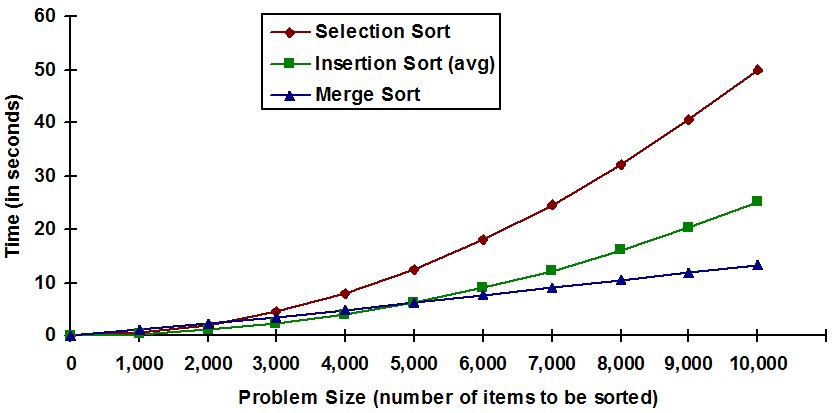
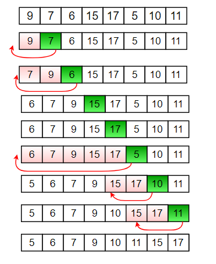
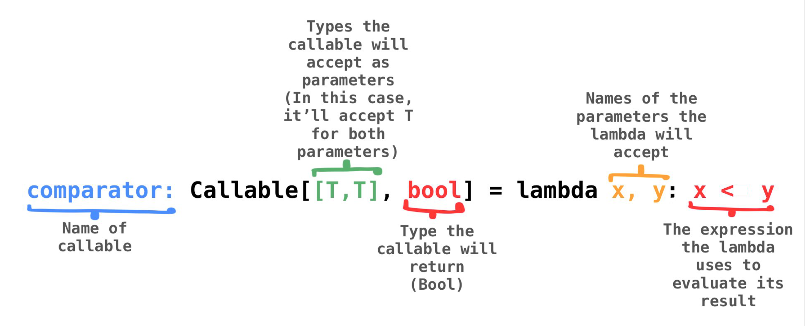

 # Project 2: Sorting Algorithms

**Due Friday, Feb 21st @ 9:00 PM ET**

_This is not a team project, do not copy someone else's work._

_Make sure to read the entire project description, especially the grading policies._

## Background Information



A **sorting algorithm** is an algorithm that puts elements in
a [certain order](https://en.wikipedia.org/wiki/Total_order). Such algorithms are often used to organize an array or
list in numerical or lexicographical order. However, their use is not limited in scope to such simple orderings, a fact
that will be demonstrated in this project.

Throughout the 20th century, as the domain of problems to which computers were applied grew, so too did the size of data
sets that required sorting. This resulted in the rapid development of sorting algorithms. Simple _O(n^2)_ algorithms,
such as selection and bubble sort, were supplemented by faster _O(n log(n))_ algorithms, such as quick or merge sort.
Still, these _O(n^2)_ algorithms have their place to this day because they are often faster for sorting small sets of
data. Optimized modern sorting methods use hybrid techniques, which leverage the recursive nature of quicksort or merge
sort by using these algorithms for large sets of data, but which use an algorithm such as insertion sort for the
smaller fragments of data that the input ends up being separated into.

This project will expose you to insertion sort, selection sort, bubble sort, merge sort, and quicksort. Additionally, it
will include a hybrid sort using merge and insertion sorts. Python's built in `list.sort` is actually based on
a ([somewhat more advanced](https://hg.python.org/cpython/file/tip/Objects/listsort.txt)) merge/insertion hybrid sort.

In addition to the overviews of each sort presented below, we encourage you to refer to the relevant sections in Zybooks.

### Bubble Sort


Bubble sort is one of the simplest sorting algorithms, and it works by repeatedly traversing a list and swapping
adjacent elements whenever it finds two that are out of order. This traversal is then repeated until a complete
traversal is completed without having to do any swaps, which indicates that the list has been sorted.

Like selection and insertion sorts, it has _O(n^2)_ worst/average case
time complexity, and can operate in-place for _O(1)_ auxiliary space complexity. Bubble sort, however, tends to be the
slowest of the sorting algorithms mentioned here in practice.

### Insertion Sort



Insertion sort works by keeping track of sorted and unsorted portions of the list, and building up the sorted portion on
the lefthand side of the list. To start, the first element is considered sorted (a single-element list is always
sorted), and the remainder of the list is the unsorted portion. Next, the first element of the unsorted portion is
compared to each element of the sorted portion in reverse order until its proper place in the sorted portion is found.
Finally, the element from the unsorted portion is _inserted_ into the list at the proper spot, which for arrays requires
a series of swaps. Each of these insertion steps increases the size of the sorted section by one, allowing the algorithm
to proceed with a new "first element of the unsorted section" until the entire list has been sorted.

Insertion sort has _O(n^2)_ worst/average case _O(n)_ for the best case, and the same space complexity as bubble sort, but ittends to be a bit faster in practice. Insertion sort is especially well suited to sorting small lists.

### Selection Sort


Selection sort works quite similarly to insertion sort, keeping a sorted and unsorted portion of the list, and building up the sorted portion one element at a time. The difference with selection sort is that instead of taking the first
element of the unsorted portion and inserting it at the proper spot, selection sort _selects_ the smallest element of the unsorted portion on each pass, and puts it at the end of the sorted portion. This time, the entire list starts out
as the unsorted portion instead of the first element being sorted–the starting element of the sorted portion has to befound from the list like every other element since elements don't move after being put in the sorted portion.

To highlight the difference: insertion sort picks a spot for the next element by searching through the sorted portion,
selection sort picks an element for the next spot by searching through the unsorted portion.

Selection sort has identical time/space complexity for the worst case just like bubble and insertion sorts, and like insertion sort is faster than
bubble sort. Still, insertion sort is usually preferred for small-data sorting.

### Merge Sort


Merge sort is a more efficient algorithm than the three mentioned above. It works on the principle of [Divide and Conquer](https://en.wikipedia.org/wiki/Divide-and-conquer_algorithm), repeatedly breaking down a list
into several sublists until each sublist consists of a single element, then repeatedly merging pairs of these sublists
in a manner that results in a sorted list.

Unlike bubble, insertion, and selection sorts, merge sort is worst case _O(n log(n))_, so it scales much better to large
lists. While there are ways to write an in-place merge sort, the typical space complexity is [_O(n)_](https://stackoverflow.com/a/28641693).

### Quicksort

Quicksort is an advanced sorting algorithm which works differently from the others we've seen so far. Like merge sort,
it is recursive, but for each step a "pivot" element from the list is selected, and elements to the left and right of the pivot are swapped as needed so that the list is partitioned into elements less than the pivot and elements greater
than or equal to the pivot. Quicksort is then applied recursively to these partitions until the list is fully sorted.

Like merge sort, quicksort is average case _O(n log(n))_, but its worst case performance is _O(n^2)_.
The performance of quicksort depends heavily on the method used for pivot selection, with the
[median-of-three pivot selection algorithm](https://stackoverflow.com/a/7560859)
helping to avoid pitfalls common in more naive (e.g., random, first, last) selection techniques.

In practice, quicksort is still popular because it performs well on array-backed lists by exploiting optimizations for [locality of reference](https://en.wikipedia.org/wiki/Locality_of_reference).
Merge sort may outperform it for very large data sets, and is usually preferred for linked lists. Both of these algorithms are significant improvements on the average case _O(n^2)_ algorithms mentioned above.

### Hybrid Sorting

While merge sort has a better runtime complexity than insertion sort, it has some overhead from not being an in-place
sort, and insertion sort tends to be faster for sorting small amounts of data. This means that it is more efficient to
combine the two algorithms into a hybrid sorting routine, where the recursive list partitions that merge sort creates
are sorted by insertion sort instead of merge sort once they get small enough.

### **Auxiliary Space Complexity: An Overview**

Auxiliary space complexity refers to the amount of additional space, aside from the input, that an algorithm or a method requires to execute. This is especially important when evaluating the efficiency of algorithms. It's different from the space complexity in that it doesn't consider the space required by the inputs; instead, it looks only at the extra space (temporary space) taken up, typically for variables, temporary structures, etc.

## Project Details

### **"There's a term for people who don't read the project details: unemployed" - Dr. Owen**

### Overview

In this project, you will be implementing: the bubble, insertion, selection, and merge sort algorithms. We will provide the completed code for the quicksort algorithm for your reference. While you don't have any assignment relating to the quicksort code on this project, we recommend looking through it to familiarize yourself with that algorithm. Multiple questions regarding quick sort
will appear on your exam, so it is in your best interest to take some time to understand it. The merge sort that you implement will be a hybrid merge sort which defers to insertion sort for handling small lists.

All the sorting algorithms should accept a custom `comparator` argument which substitutes for `<` when comparing
items to put in the list. If calling `comparator(a, b)` returns `True`, you should read that result as "`a` should come before `b` in a sorted list."

There is also an argument `descending` which defaults to `False`. If
the `descending` argument is `True`, you should sort the list in descending order. Since you can sort the list in
descending order by flipping the order of the inputs of the comparator and leaving the other logic the same, it might be
helpful for you to write a _helper function_, perhaps called `do_comparison`, which takes elements `a` and `b`, the `comparator`, and `descending` as arguments, and tells you whether or not to put `a` before `b` in the sorted list. This helper function should only be a few lines!
Implementing this function is **highly recommended** as it greatly simplifies the logic in your sorting functions.

It is important to note that **_the comparator means strictly `<` and not `<=`_**, so for descending you should
consider `comparator(b, a)` instead of `not comparator(a, b)`, since the second one would give you `a >= b` instead of
`a > b`. If you did it the second way, your bubble sort might never stop swapping!

You can call the argument `comparator` the same as any other function, and the underlying function that gets called will
be whatever function was passed in for this argument. This takes advantage of the fact that Python has what are
called [first-class functions](https://en.wikipedia.org/wiki/First-class_function), meaning functions can be stored and
passed around the same way as any other type of value. The type of `comparator` is explained by this diagram:



Also note that some arguments will be specified after the pseudo-argument `*,`.
The arguments following the asterisk `*` are ["keyword-only" arguments](https://www.python.org/dev/peps/pep-3102/).
Keyword-only arguments are designed to prevent accidental miscalls that can occur with positional parameters.

```python
# Note the "argument" *, which some of the other arugments come after
def some_func(a, b, *, c, d):
	pass

# Ok
some_func(1, 2, c=3, d=4)

# will raise TypeError: some_func() takes 2 positional arguments but 4 were given
some_func(1, 2, 3, 4)
```

### Tips, Tricks, and Notes

- There are different ways to implement merge sort, but make sure you are aiming for a solution that will fit the time
  complexity! If your recursive calls are some form of `hybrid_merge_sort(data[1:])`, this will not be _O(n log(n))_, as this does not divide the input list in half.
- A recursive implementation of merge sort will be the easiest to write. As you split the arrays, you should switch to
  insertion sort as soon as the split arrays get smaller than threshold. This means each of the recursive calls should
  be using the same threshold, such that the threshold is considered at each recursive call.
- Make sure to pass `comparator` and `descending` properly for all recursive calls as well.
- Using a helper function to do your comparisons that takes `descending` into account will make your code much easier
  to write. Look at the `do_comparison` stub that's provided in the starter code.
- Try these web applications to visualize sorting algorithms:
  - <https://visualgo.net/bn/sorting>
  - <https://opendsa-server.cs.vt.edu/embed/mergesortAV> (good merge sort visualization)
  - <https://www.cs.usfca.edu/~galles/visualization/ComparisonSort.html>

### Assignment Specs

You will be given one file to edit, `solution.py`. You must complete and implement the following functions. Take note of
the specified return values and input parameters.

**_DO NOT USE BUILT-IN SORT FUNCTIONS LIKE `list.sort()` or `sorted()` FOR THIS PROJECT IN ANY FUNCTION! ANY FUNCTION THAT USES A BUILT-IN SORT WILL LOSE ALL AUTO AND MANUAL GRADE FOR THAT FUNCTION._**

**_Do not change the function signatures, including default values._**

**_If you implement a function that passes the tests but does not use the specified sorting algorithm for that function_,
\*you will not get **any** points for that function.\***

Make sure to consult the lectures, Zybooks, and other resources available if
you are not sure how a given sorting algorithm works. To earn manual points, you must also meet the required time and
space complexity. Using the right algorithm will help!

**solution.py:**

- **selection_sort(data: List[T], \*, comparator: Callable[[T,T], bool], descending: bool = False)**

  - Given a list of values, sort that list in-place using the selection sort algorithm and the provided comparator,
	and perform the sort in descending order if `descending` is `True`.
  - **param data**: List of items to be sorted
  - **param comparator**: A function which takes two arguments of type `T` and returns `True` when the first argument
	should be treated as less than the second argument.
  - **param descending**: Perform the sort in descending order when this is `True`. Defaults to `False`.
  - Time Complexity: _O(n^2)_
  - Aux.Space Complexity: _O(1)_

- **bubble_sort(data: List[T], \*, comparator: Callable[[T,T], bool], descending: bool = False)**

  - Given a list of values, sort that list in-place using the bubble sort algorithm and the provided comparator,
	and perform the sort in descending order if `descending` is `True`.
  - **param data**: List of items to be sorted
  - **param comparator**: A function which takes two arguments of type `T` and returns `True` when the first argument
	should be treated as less than the second argument.
  - **param descending**: Perform the sort in descending order when this is `True`. Defaults to `False`.
  - Time Complexity: _O(n^2)_
  - Aux.Space Complexity: _O(1)_

- **insertion_sort(data: List[T], \*, comparator: Callable[[T,T], bool], descending: bool = False)**

  - Given a list of values, sort that list in-place using the insertion sort algorithm and the provided comparator,
	and perform the sort in descending order if `descending` is `True`.
  - **param data**: List of items to be sorted
  - **param comparator**: A function which takes two arguments of type `T` and returns `True` when the first argument
	should be treated as less than the second argument.
  - **param descending**: Perform the sort in descending order when this is `True`. Defaults to `False`.
  - Time Complexity: _O(n^2)_
  - Aux.Space Complexity: _O(1)_

- **hybrid_merge_sort(data: List[T], \*, threshold: int = 12, comparator: Callable[[T,T], bool], descending: bool = False)**
  - Given a list of values, sort that list using a hybrid sort with the merge sort and insertion sort
	algorithms and the provided comparator, and perform the sort in descending order if `descending` is `True`.
	The function should use `insertion_sort` to sort lists once their size is less than or equal to `threshold`, and
	otherwise perform a merge sort. DO NOT hardcode the threshold check such as `if threshold == {any value}`. Hint: Think about what should happen for lists with only one item.
  - **IMPORTANT**: Every semester there are students that don't actually implement a hybrid sort. These students generally make one of these mistakes:
	1. Check the threshold only once in hybrid*sort, and not for \_every* recursive call of merge_sort (if implemented separately).
	2. Call insertion_sort in each recursive call of merge sort, regardless of threshold
	3. Call merge_sort regardless of threshold
	4. Forget to pass threshold to each call of merge_sort
  - **param data**: List of items to be sorted
  - **param threshold**: Maximum size at which insertion sort will be used instead of merge sort. **Students frequently make mistakes with this, so be careful!**
  - **param comparator**: A function which takes two arguments of type `T` and returns `True` when the first argument
	should be treated as less than the second argument.
  - **param descending**: Perform the sort in descending order when this is `True`. Defaults to `False`.
  - Time Complexity: _O(n log(n))_
  - Aux. Space Complexity: _O(n)_

## Application Problem: Song Recommendations on Spotify

### Background:

Platforms like Spotify use different kinds of algorithms to
analyze metadata and the audio of the song itself to find the perfect next song
for you to listen to. While the exact details to their algorithms and how they
calculate how relevant a song is are hidden, relevances can be calculated to
determine how enjoyable the song is for people who listen to a specific genre.

In this project, you will be given a lot of different songs, and their relevance to specific users who listen to certain genres. You will have to use this data to pick out songs for a specific user.

### Challenge:

To get the top 10 songs (or less if less than 10 are given) that fit the profile of the user in order of when they were released, with the songs in order of the users preference, newest or oldest first.

1. Sort the list in order of the user's genre preference. (e.g. If the user preference is ["rock", "pop", "rap"] with “rap” being the most preferred sorting criterion and “rock” the least, then sort by “rock” first, then “pop”, then “rap” - check **Stable Sorting Algorithms and Tiebreakers** below for more explanation).
2. Select the top 10 songs. If there are less than 10 total songs, then just use that amount.
3. Sort the selected songs according to the user's preference on date ("newest" song first or "oldest" song first).


### Explanation: Stable Sorting Algorithms and Tiebreakers

- Stable sorting algorithms: A sort algorithm is stable if the relative order of equivalent keys is maintained after sorting. You will be calling **hybrid_merge_sort** method for this question. Merge sort and insertion sort from **hybrid_merge_sort** are both stable.
- Genre preference: If the input **genres_user** is ["rock", "pop"], "pop" is preferred over "rock" when sorting. In other words, we first sort by "pop". If multiple songs have the same "pop" value, we break the tie by sorting them based on their "rock" values.
- How to make use of a stable sorting algorithm to implement genre preference? 

  (1) If the input **genres_user** is ["rock", "pop"], we first sort by "rock". If there are songs sharing the same "pop" value, their relative order is determined in this first sort.

  (2) Then, we sort by "pop", ensuring that songs with the same "pop" value remain in the order determined by "rock". Because merge sort is stable, this ensures the final result is sorted by "pop", with ties broken by "rock".


You are given the class Song described below. **DO NOT** modify this class - any modification will result in zero for this portion of the project.

<hr>

**class Song:**

_DO NOT MODIFY the following attributes/functions._

- **Attributes:**

  - **rock**: **float**: The relevance to R&B listeners, from 0-1. The closer it is to 1 the more relevant.
  - **pop**: **float**: The relevance to pop listeners, from 0-1. The closer it is to 1 the more relevant.
  - **rap**: **float**: The relevance to rap listeners, from 0-1. The closer it is to 1 the more relevant.
  - **jazz**: **float**: The relevance to jazz listeners, from 0-1. The closer it is to 1 the more relevant.
  - **date_published**: **Date**: Date the song as published.


- **\_\_init\_\_(self, rock: float, pop: float, rap: float, jazz: float, date_published: Date) -> None**

  - Constructs a **Song** object.
  - **rock**: **float**: value to assign as rock relevance.
  - **pop**: **float**: value to assign as pop relevance.
  - **rap**: **float**: value to assign as rap relevance.
  - **jazz**: **float**: value to assign as jazz relevance.
  - **date_published**: **Date**: value to assign as date published.
  - **return: None**

- **\_\_eq\_\_(self, other) -> bool**

  - Returns True if two songs are equal, False otherwise.
  - **return: bool**

- **\_\_repr\_\_(self) -> str**

  - Returns the Song as a string representation (for debugging).
  - **return: string**

- **\_\_str\_\_(self) -> str**
  - Returns the Song as a string representation.
  - **return: string**

**_MODIFY BELOW_**:

<hr>

```python
def get_relevant_songs(songs: List[Song], genres_user: List[Literal['rock', 'pop', 'rap', 'jazz']], order_by: Literal['newest', 'oldest'] ) -> List[Song]:
```

- This method will select the top 10 songs based on relevance and sort them according to order_by.

- **Input**:
  - **songs: List[Song]**: A list of songs.
  - **genres_user: List[Literal['rock', 'pop', 'rap', 'jazz']]**: The genres to sort by. For example, if genres_user = ["pop","rock"], then sort by pop, and afterwards rock.
  - **order_by: Literal['newest', 'oldest']**: A string object representing which the order in which to return the songs. If order_by = "newest", then return the songs in order of last date published to first, and if order_by = "oldest", return the songs in order of first song published to last.
- **Output**:

  - []: if the input **songs** is empty.
  - **List[Song]**: sorted list of relevant songs.

- **Complexity**:
  - Time: _O(n logn)_
  - Space: _O(n)_

- **IMPORTANT NOTE**:
  - You must call your **hybrid_merge_sort** function for this question.
  - While calling the **hybrid_merge_sort** function to solve the application problem, you should ensure that it runs **purely** as merge sort. Choose your threshold value carefully so that **hybrid_merge_sort** does not switch to insertion sort, otherwise you **will be deducted points for not meeting time complexity**.


### Sample Scenarios:

#### Scenario 1

```python
from datetime import date

songs = [
	Song(0.1, 0.3, 0.4, 0.99, date(2000, 4, 19)),
	Song(0.6, 0.21, 0.53, 0.64, date(2005, 8, 15)),
	Song(0.2, 0.45, 0.32, 0.87, date(2010, 3, 10)),
	Song(0.78, 0.12, 0.56, 0.43, date(2015, 11, 25)),
	Song(0.33, 0.77, 0.89, 0.15, date(2020, 7, 5)),
	Song(0.51, 0.61, 0.41, 0.92, date(2023, 2, 14)),
	Song(0.29, 0.58, 0.74, 0.68, date(2024, 12, 19))
]
# The order of the parameters in the songs above is rock, pop, rap, jazz, and date


output = get_relevant_songs(songs, ["pop","jazz","rock"], "newest")
"""
Sorted by pop, jazz, rock, and date then select the top 10 (in this case since < 10 select all)
Expected = [
Song(0.29, 0.58, 0.74, 0.68, date(2024, 12, 19)),
Song(0.51, 0.61, 0.41, 0.92, date(2023, 2, 14)),
Song(0.33, 0.77, 0.89, 0.15, date(2020, 7, 5)),
Song(0.78, 0.12, 0.56, 0.43, date(2015, 11, 25)),
Song(0.2, 0.45, 0.32, 0.87, date(2010, 3, 10)),
Song(0.6, 0.21, 0.53, 0.64, date(2005, 8, 15)),
Song(0.1, 0.3, 0.4, 0.99, date(2000, 4, 19))]


"""
```


#### Scenario 2

```python
from datetime import date

songs = [
	Song(0.35, 0.29, 0.47, 0.82, date(1999, 12, 15)),
	Song(0.61, 0.18, 0.59, 0.75, date(2003, 6, 30)),
	Song(0.42, 0.41, 0.34, 0.89, date(2007, 4, 10)),
	Song(0.57, 0.62, 0.73, 0.58, date(2012, 9, 25)),
	Song(0.49, 0.33, 0.66, 0.79, date(2016, 3, 14)),
	Song(0.71, 0.56, 0.44, 0.68, date(2019, 11, 8)),
	Song(0.28, 0.24, 0.51, 0.92, date(2021, 7, 21)),
	Song(0.64, 0.45, 0.38, 0.73, date(2024, 1, 3)),
	Song(0.37, 0.51, 0.42, 0.67, date(2025, 5, 15)),
	Song(0.53, 0.39, 0.49, 0.85, date(2027, 8, 19))
]

output = get_relevant_songs(songs, ["rock", "jazz"], "oldest")
"""
Expected = [Song(0.35, 0.29, 0.47, 0.82, date(1999, 12, 15)),
	Song(0.61, 0.18, 0.59, 0.75, date(2003, 6, 30)),
	Song(0.42, 0.41, 0.34, 0.89, date(2007, 4, 10)),
	Song(0.57, 0.62, 0.73, 0.58, date(2012, 9, 25)),
	Song(0.49, 0.33, 0.66, 0.79, date(2016, 3, 14)),
	Song(0.71, 0.56, 0.44, 0.68, date(2019, 11, 8)),
	Song(0.28, 0.24, 0.51, 0.92, date(2021, 7, 21)),
	Song(0.64, 0.45, 0.38, 0.73, date(2024, 1, 3)),
	Song(0.37, 0.51, 0.42, 0.67, date(2025, 5, 15)),
	Song(0.53, 0.39, 0.49, 0.85, date(2027, 8, 19))]

"""
```

#### Scenario 3

```python
from datetime import date

songs = [
	Song(0.1, 0.3, 0.4, 0.99, date(2000, 4, 19)),
	Song(0.6, 0.21, 0.53, 0.64, date(2005, 8, 15)),
	Song(0.2, 0.45, 0.32, 0.87, date(2010, 3, 10)),
	Song(0.78, 0.12, 0.56, 0.43, date(2015, 11, 25)),
	Song(0.33, 0.77, 0.89, 0.15, date(2020, 7, 5)),
	Song(0.51, 0.59, 0.74, 0.92, date(2024, 12, 19)),
	Song(0.29, 0.58, 0.74, 0.68, date(2024, 12, 19))
]
# Notice how the last two songs have the same date and jazz score

output = get_relevant_songs(songs, ["pop", "jazz"], "newest")
"""
Expected = [
	Song(0.51, 0.59, 0.74, 0.92, date(2024, 12, 19)),
	Song(0.29, 0.58, 0.74, 0.68, date(2024, 12, 19)),
	Song(0.33, 0.77, 0.89, 0.15, date(2020, 7, 5)),
	Song(0.78, 0.12, 0.56, 0.43, date(2015, 11, 25)),
	Song(0.2, 0.45, 0.32, 0.87, date(2010, 3, 10)),
	Song(0.6, 0.21, 0.53, 0.64, date(2005, 8, 15)),
	Song(0.1, 0.3, 0.4, 0.99, date(2000, 4, 19))
]
Since we sorted by pop first, the first song is above the second
song despite being tied in jazz and date
(Try to think of what property of a sorting algorithm guarantees
that this order will stay when sorting by jazz and date)
"""
```

## **Application Problem Notes:**

- Keep in mind that objects of the Song class are custom objects with multiple attributes. In order to sort custom objects in Python (within the scope of this project), you **MUST** pass a custom comparator to the desired sorting method.

- To get a property of an object using a variable, you cannot use the normal subscript notation. For example, if you have a variable named p that holds the name of the property (in this case name), the following is not allowed: (p='name',  person[p]), instead you have to use the <a href="https://docs.python.org/3/library/functions.html#getattr">getattr function</a>.

- There are various approaches to creating a custom comparator that can be used by the sorting methods implemented in this project; You could use <a href="https://www.w3schools.com/python/python_lambda.asp">Python Lambda functions</a>, helper functions, or even inner functions.

> An extra note on lambda functions... <br>
> Lambda functions are an easy way to specify a **very** small function, usually a few arguments, and one line at most.
> Lets see how two functions could be implemented, one using lambda functions, one using regular functions
>
> ```
> # Using regular functions
> def return_addition(x, a):
>   return x + a
>
> # Using lambda function
> lambda_addition = lambda x, a: x + a
>
> print(return_addition(3,5)) # prints 8
> print(lambda_addition(3,5)) # also prints 8
> ```
>
> Notice the lambda "anatomy". `lambda x, a:` defines the argument(s) of the function. Everything after the `:` will be returned by that function.

- Refer to the default parameters of the various sorting functions implemented in this project (except quicksort) to see a basic example of a comparator.

**Application Problem Authors**: _Daniel Berezovsky, Leo Specht, Manni Liu_

## **Submission Guidelines**

### **Deliverables:**

For each project, a `solution.py` file will be provided. Ensure to write your Python code within this file. For best results:

- 📥 **Download** both `solution.py` and `tests.py` to your local machine.
- 🛠️ Use **PyCharm** for a smoother coding and debugging experience.

### **How to Work on a Project Locally:**

Choose one of the two methods below:

---

#### **APPROACH 1: Using D2L for Starter Package**

1. 🖥️ Ensure PyCharm is installed.
2. 📦 **Download** the starter package from the _Projects_ tab on D2L. _(See the tutorial video on D2L if needed)_.
3. 📝 Write your code and, once ready, 📤 **upload** your `solution.py` to Codio. _(Refer to the D2L tutorial video for help)_.

---

#### **APPROACH 2: Directly from Codio**

1. 📁 On your PC, create a local folder like `Project02`.
2. 📥 **Download** `solution.py` from Codio.
3. 📥 **Download** `tests.py` from Codio for testing purposes.
4. 🛠️ Use PyCharm for coding.
5. 📤 **Upload** the `solution.py` back to Codio after ensuring the existing file is renamed or deleted.
6. 🔚 Scroll to the end in Codio's Guide editor and click the **Submit** button.

---

### **Important:**

- Always **upload** your solution and **click** the 'Submit' button as directed.
- All project submissions are due on Codio. **Any submission after its deadline is subject to late penalties**.

**Tip:** While Codio can be used, we recommend working locally for a superior debugging experience in PyCharm. Aim to finalize your project locally before submitting on Codio.

### Grading

The following 100-point rubric will be used to determine your grade on Project 2:

- Policies
  - **_Making all of these policies bold or italic would get too visually fatiguing but read them all because they're
	important!_**
  - Using a different sorting algorithm than the one specified for some function will result in the loss of all
	automated and manual points for that function.
  - Not making the merge sort **_hybrid_** will result in the loss of half of all automated and manual points for that
	function.
  - You will not receive any points for that function if you use Python's built-in sorting functions or sorting functions
	imported from any library.
  - You will not receive any points on the project if you use any list-reversing function such as `reversed`,
	`list.reverse`, or a homemade alternative to these. You must sort the lists in ascending or descending order
	directly.

**Important Note about Using Sorts on the Application Problem:**

- You **must** use a sort that you have implemented yourself. Using bulit-in sort functions like `list.sort()` or `sorted()` will lose all auto and manual grade for the application problem.
- Using the provided full implementation of QuickSort will result in **zero points**.
- If you opt to use QuickSort, all points (both manual and auto-graded) will be **deducted**.

- Tests (70)
- Sorts: \_\_/50
  - Selection: \_\_/11
	- test_selecton_sort_basic: \_\_/3
	- test_selection_sort_comparator: \_\_/3
	- test_selection_sort_descending: \_\_/3
	- test_selection_sort_comprehensive: \_\_/2
  - Bubble: \_\_/11
	- test_bubble_sort_basic: \_\_/3
	- test_bubble_sort_comparator: \_\_/3
	- test_bubble_sort_descending: \_\_/3
	- test_bubble_sort_comprehensive: \_\_/2
  - Insertion: \_\_/11
	- test_insertion_sort_basic: \_\_/3
	- test_insertion_sort_comparator: \_\_/3
	- test_insertion_sort_descending: \_\_/3
	- test_insertion_sort_comprehensive: \_\_/2
  - Hybrid Merge: \_\_/17
	- test_hybrid_merge_sort_basic: \_\_/3
	- test_hybrid_merge_sort_threshold: \_\_/4
	- test_hybrid_merge_sort_comparator: \_\_/4
	- test_hybrid_merge_sort_descending: \_\_/4
	- test_hybrid_merge_sort_comprehensive: \_\_/2
	- test_hybrid_merge_sort_speed: \_\_/0
  	- This test helps checking if your hybrid merge sort is implemented properly to make sure your code time complexity is correct
	- test_hybrid_merge_actually_hybrid: \_\_/0
  	- This test is similar to test_hybrid_merge_sort_speed, but it checks if your hybrid merge sort function is a true hybrid merge sort or not.
  	- NOTE: one way to fail this test is if `hybrid_merge_sort` doesn't call itself recursively (e.g. if you have a separate `merge_sort` helper function). In this case, you must take extra care and ensure that your overall algorithm **is actually hybrid** to avoid losing manual points.
  - Application: \_\_/20
	- test_get_relevant_songs: \_\_/20


**Additional Note on Scenario Generation:**

While we make every effort to generate test cases that encompass every possible scenario, there might be times when some edge cases are inadvertently overlooked. Nevertheless, should we identify any scenario where your submitted logic doesn't hold, even if it's not part of our provided test cases, we reserve the right to deduct from the manual points. This highlights the significance of crafting logic that doesn't merely pass the given tests, but is genuinely resilient and correctly addresses the problem's entirety. Always strive to think beyond the provided cases, ensuring that your solutions are comprehensive and robust.

- **Manual (30 points)**
  - Time and Space complexity points are **divided equally** for each function. If you fail to meet time **or** space complexity in a given function, you receive half of the manual points for that function.
  - Loss of 1 point per missing docstring (max 5 point loss)
  - Loss of 2 points per changed function signature (max 20 point loss)
  - **Loss of complexity and loss of testcase points for the required functions in this project. You may not use any additional data structures such as dictionaries, and sets!**
  - M1 - selection sort: \_\_/4
  - M2 - bubble sort: \_\_/4
  - M3 - insertion sort: \_\_/4
  - M4 - hybrid sort: \_\_/8
  - M6 - recommend_products: \_\_/10

* We probably don't have to tell you this if you made it this far but make sure to read the specs including all grading
  requirements!

  - **DOCSTRING** is not provided for this project. Please use Project 1 as a template for your DOCSTRING.
	To learn more on what is a DOCSTRING visit the following website: [What is Docstring?](https://peps.python.org/pep-0257/)
	- One point per function that misses DOCSTRING.
	- Up to 5 points of deductions.

<input type="checkbox"> <b>STEP 1: Rename the old solution file by clicking Rename button below. This button renames your file to **solution_old.py** </b>
{Rename}(mv solution.py solution_old.py)

<input type="checkbox"> <b>STEP 2: Refresh your file tree by clicking on the refresh button under project name or refresh your browser. </b>

<input type="checkbox"> <b>STEP 3: Upload your **solution.py** from your computer to Codio File Tree on the left. Refresh your file tree or browser to see if it actually updated the solution.py </b>

<input type="checkbox"> <b>STEP 4: Submit your code, by clicking the Submit button, you can submit as many times as you like, no limit on submission.

Submit button is tied to tests.py in our secure folder, and it always gets the updated version of the tests.py. In case of any tests.py update, students will always get the latest version to test their code through the submit button.
{SUBMIT!|assessment}(test-3379255259)
Please note that there will be manual grading after you submit your work. Clicking Submit only runs the Auto-grader for the test cases. Manual Grading is 30 points in this project.

<input type="checkbox"> <b>STEP 5: Please make sure to **scroll all the way down on Guide Editor page**, Guide is the specs document, it is the document you are reading right now, scroll all the way down, and **click at the Mark as Completed button**, see below for the image of the button so you know what it looks like. Please scroll down and actually push the button. If you do not mark complete yourself, Codio will mark it at the end of the last penalty day, which will give 0 to your project. </b>


{Check It!|assessment}(grade-book-3266829715)
{Submit Answer!|assessment}(free-text-3024451938)
