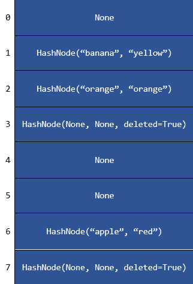

# Project 3: Hash Tables

**Due: Friday, February 28 @ 9:00 PM ET**

_This is an individual project. Do not copy or share your work._

## Assignment Overview

Hash tables are a powerful data structure known for their ability to perform insertion, deletion, and lookup operations with an expected runtime of **O(1)**. This makes them highly efficient for storing and retrieving data quickly.



```python
>>> print(fruit_colors["banana"])
yellow
```

In this project, you will implement a **hash table** from scratch in Python and apply it to solve application problems.

## Assignment Notes

1. **Prohibited Operations:** Using any of the following will result in the **loss of all test case and manual grading points** for the violating function:
   - A Python dictionary (`dict`)
   - Any built-in container or collection other than a **basic list, tuple, or set**
   - The `nonlocal` keyword

2. **Improper Use of Magic or Protected Methods:**  
   Each violation will result in a **2-point deduction**, up to a maximum of **20 points**.
   - Calling a magic method such as `__len__()` directly with `table.__len__()` instead of using the correct syntax `len(table)`.
   - Calling a protected method like `_insert()` outside of its implementing class (use `__setitem__()` instead).
   - Refer to the section below for details on magic and protected methods.

3. **Function Signature Modifications:**  
   Each violation will result in a **2-point deduction**, up to a maximum of **20 points**.
   - In professional and open-source codebases, function signatures are rarely changed. This project enforces that practice.
   - Altering function signatures may cause test cases to fail.

4. **Magic Methods:**  
   - Magic methods are special methods in Python that begin and end with double underscores, such as `__len__()`.
   - In this project, magic methods serve primarily as wrappers that call protected methods.
   - These methods should be **brief**, typically no more than a few lines of code.
   - Refer to the syntax table below to understand the relationship between magic and protected methods.

5. **Protected Methods:**  
   - Protected methods begin with a single underscore, such as `_insert()`, to indicate they are intended for internal use.
   - Unlike in languages like C++, Python does not strictly enforce method privacy.
   - Consider magic methods as the **interface** and protected methods as the **implementation**.
   - Refer to the syntax table below for guidance on their usage.

6. **Proper Work Distribution Between Magic and Protected Methods:**  
   - Most testing will be conducted on the magic methods `__setitem__()`, `__getitem__()`, and `__delitem__()`, simulating real-world use.
   - These magic methods should delegate core functionality to `_insert()`, `_get()`, and `_delete()`, respectively.
   - Ensure your work is properly divided by testing `_insert()`, `_get()`, and `_delete()` separately before integrating them into the magic methods.

7. **Hash Function Considerations:**  
   - `_hash_1` and `_hash_2` depend on the string's size.
   - For this project, assume they run in **O(1) (constant) time**.

8. **Project Constraints:**  
   - The **maximum capacity** will not exceed **1,000**.
   - **All keys** will be of type **string**.

9. **Space Complexity Considerations:**  
   - Hash tables inherently allocate **O(N)** space.
   - Python dictionaries are optimized for space efficiency, but this project requires load factor constraints that may increase space usage.
   - While overall space usage is **O(N)**, focus on **minimizing auxiliary (extra) memory usage**.
   - Aim to keep auxiliary space usage within **O(N)**.

### Syntax Table: Magic vs. Protected Methods

| Protected Method             | Magic Method                     | How to Use Magic Methods  |
|------------------------------|----------------------------------|---------------------------|
|                              | `__len__(self)`                  | `len(self)`               |
| `_insert(self, key, value)`  | `__setitem__(self, key, value)`  | `self[key] = value`       |
| `_get(self, key)`            | `__getitem__(self, key)`         | `self[key]`               |
| `_delete(self, key)`         | `__delitem__(self, key)`         | `del self[key]`           |
|                              | `__contains__(self, key)`        | `key in self`             |

## Assignment Specifications

\* Denotes _Expected Run Time Complexity_

#### class HashNode:

_DO NOT MODIFY the following attributes/functions_

- **Attributes**
  - **key: str:** The key of the hash node (this is what is used in hashing).
  - **value: T:** The value stored in the node. This can be any type, such as a `str`, `int`, `float`, `dict`, or a more complex object.
  - **deleted: bool:** Indicates whether the node has been deleted.

- **\_\_init\_\_(self, key: str, value: T, deleted: bool = False) -\> None**
  - Constructs a hash node.
  - **key: str:** The key of the hash node.
  - **value: T:** The value stored in the node.
  - **deleted: bool:** Indicates whether the node has been deleted. Defaults to `False`.
  - **Returns:** `None`.
  - _Time Complexity: O(1)_

- **\_\_str\_\_(self) -\> str** and **\_\_repr\_\_(self) -\> str**
  - Represents the `Node` as a string.
  - **Returns:** `str` representation of the node.
  - _Time Complexity: O(1)_

- **\_\_eq\_\_(self, other: HashNode) -\> bool**
  - Compares two hash nodes to determine if they are equal.
  - **other: HashNode:** The `HashNode` to compare against.
  - **Returns:** `bool` indicating whether they are equal.
  - _Time Complexity: O(1)_

#### class HashTable:

_DO NOT MODIFY the following attributes/functions_

- **Attributes** (You may edit the values of attributes but do not remove them.)
  - **capacity: int:** The capacity of the hash table.
  - **size: int:** The current number of nodes in the hash table.
  - **table: List:** Stores the actual data for the hash table.
  - **prime_index: int:** The current index of prime numbers used in `_hash_2()`.

- **primes**
  - This is a list of all prime numbers from 2 to 8000, used for `_hash_2()`. This is a **class attribute**, so it is **accessed using `HashTable.primes`, NOT `self.primes()`!**

- **\_\_init\_\_(self, capacity: int = 8) -\> None**
  - Constructs an empty hash table with the specified capacity.
  - **capacity: int:** The initial capacity of the hash table. Defaults to `8`.
  - **Returns:** `None`.
  - _Time Complexity: O(1)_

- **\_\_str\_\_(self) -\> str** and **\_\_repr\_\_(self) -\> str**
  - Represents the `HashTable` as a string.
  - **Returns:** `str`.
  - _Time Complexity: O(N)_

- **\_\_eq\_\_(self, other: HashTable) -\> bool**
  - Checks if two `HashTable` instances are equal.
  - **other: HashTable:** The hash table to compare against.
  - **Returns:** `bool` indicating equality.
  - _Time Complexity: O(N)_

- **\_hash_1(self, key: str) -\> int**
  - The first hash function used to compute a bin number for a given key.
  - Assume this runs in **O(1)** time and space complexity.
  - **key: str:** The key to hash.
  - **Returns:** `int` representing the bin number.
  - _Time Complexity: O(1)_

- **\_hash_2(self, key: str) -\> int**
  - The second hash function, which serves as a tie-breaker.
  - Assume this runs in **O(1)** time and space complexity.
  - **key: str:** The key to hash.
  - **Returns:** `int` representing the bin number.
  - _Time Complexity: O(1)_

**_IMPLEMENT the following functions_**

- **\_\_len\_\_(self) -\> int**
  - Returns the number of elements in the hash table.
  - **Do not call this function directly!** Use the built-in `len()` function instead.
  - This function should be one line!
  - _Time Complexity: O(1)_
  - **Returns:** `int` representing the size of the hash table.

- **\_\_setitem\_\_(self, key: str, value: T) -\> None**
  - Sets a value associated with a given key in the hash table.
  - **_This should be a short (~1 line) function._** The majority of the work should be done in `_insert()`.
  - _Time Complexity: O(1)_
  - **key: str:** The key to hash.
  - **value: T:** The associated value to store.
  - **Returns:** `None`.

- **\_\_getitem\_\_(self, key: str) -\> T**
  - Retrieves the value associated with a given key.
  - Raises a **KeyError** if the key does not exist.
  - **_This should be a short (~3 line) function._** The majority of the work should be done in `_get()`.
  - _Time Complexity: O(1)_
  - **key: str:** The key to search for.
  - **Returns:** The value associated with the key.

- **\_\_delitem\_\_(self, key: str) -\> None**
  - Deletes the value associated with a given key in the HashTable.
  - If the key does not exist in the table, raises a **KeyError**.
  - **_This should be a short (~3 line) function._** The majority of the work should be done in the `_get()` and `_delete()` methods.
  - _Time Complexity: O(1)_
  - **key: str:** The key whose associated value is to be deleted.
  - **Returns:** `None`.

- **\_\_contains\_\_(self, key: str) -\> bool**
  - Determines if a node with the specified key exists in the table.
  - **_This should be a short (~3 line) function._** The majority of the work should be done in the `_get()` method.
  - _Time Complexity: O(1)_
  - **key: str:** The key to check in the hash table.
  - **Returns:** `True` if the key exists in the HashTable, `False` otherwise.

- **\_hash(self, key: str, inserting: bool = False) -\> int**
  - Computes an index in the hash table for a given key.
  - Implements probing with double hashing.
  - If the key exists in the hash table, returns the index of the existing HashNode.
  - If the key does not exist (i.e., `None` at the key location), returns the index of the next available empty bin.
  - Collision resolution follows double hashing, using `_hash_1()` as the initial hash and `_hash_2()` as the step size.
  - _Time Complexity: O(1)_
  - **key: str:** The key to hash.
  - **inserting: bool:** Specifies whether this operation is for insertion or lookup.
  - **Returns:** `int` representing the computed bin index.

- **\_insert(self, key: str, value: T) -\> None**
  - Inserts a `HashNode` into the hash table.
  - **Requires `_grow()` to function properly!** If you are having trouble, complete `_grow()` first.
  - If the key already exists, its value is overwritten.
  - If inserting a new key causes the **load factor to reach 0.5 or higher**, the table should be **doubled in size** using `_grow()`.
  - _Time Complexity: O(1)_
  - **key: str:** The key for the stored value.
  - **value: T:** The associated value.
  - **Returns:** `None`.

- **\_get(self, key: str) -\> Optional[HashNode]**
  - Finds the `HashNode` corresponding to the given key in the hash table.
  - If the key does not exist, returns `None`.
  - _Time Complexity: O(1)_
  - **key: str:** The key to search for.
  - **Returns:** `HashNode` if found, otherwise `None`.

- **\_delete(self, key: str) -\> None**
  - Removes a `HashNode` corresponding to the given key from the hash table.
  - If the node is found, its key and value are set to `None`, and the deleted flag is marked as `True`.
  - The size of the table is only decreased if the node was not previously marked as deleted.
  - _Time Complexity: O(1)_
  - **key: str:** The key of the node to delete.
  - **Returns:** `None`.

- **\_grow(self) -\> None**
  - Doubles the capacity of the hash table when the load factor reaches 0.5 or higher.
  - Deleted `HashNodes` should **not** be rehashed.
  - Updates `self.prime_index` to reference the **largest prime number smaller than the new capacity** from `HashTable.primes`.
  - **Uses `_insert()` to rehash existing values!**
  - _Time Complexity: O(N)_
  - **Returns:** `None`.

- **update(self, pairs: List[Tuple[str, T]] = []) -\> None**
  - Updates the hash table with an iterable of key-value pairs.
  - If a key already exists, updates its value; otherwise, inserts a new key-value pair.
  - **Requires `_insert()` to function properly!**
  - _Time Complexity: O(M), where M is the length of `pairs`.
  - **pairs:** A list of tuples `(key, value)` to be added or updated.
  - **Returns:** `None`.

- **keys(self) -\> List[str]**
  - Returns a list of all keys in the hash table.
  - Order does not matter.
  - Ensure nonexistent (`None`) and deleted `HashNodes` are excluded.
  - _Time Complexity: O(N)_
  - **Returns:** A list of keys.

- **values(self) -\> List[T]**
  - Returns a list of all values stored in the hash table.
  - Order does not matter.
  - _Time Complexity: O(N)_
  - **Returns:** A list of stored values.

- **items(self) -\> List[Tuple[str, T]]**
  - Returns a list of key-value pairs in the hash table.
  - Order does not matter.
  - _Time Complexity: O(N)_
  - **Returns:** A list of tuples `(key, value)`.

- **clear(self) -\> None**
  - Clears all `HashNodes` from the table as if they never existed.
  - Does **not** modify capacity.
  - _Time Complexity: O(N)_
  - **Returns:** `None`.


## Application: Image Duplicates


**Important: The use of `sort()` or any sorting method is prohibited for this problem. Otherwise, you will receive a 0 on the application problem.**

Congratulations! You have just been hired full-time as an application developer consultant for Dream Company LLC! For your first task, the client has requested that you create an app that detects and displays information about duplicate images in a folder. The goal of this app is:

- To tell users which images they should keep (the earliest image in the set of duplicates).
- To inform users which images are duplicates of the images they should keep, i.e., the ones they should delete.

You smile to yourself since you know that your trusty `HashTable` is perfect for detecting duplicates. Like many objects, images can be hashed (explained below), so you only need to populate a `HashTable` and check if the image is already present to detect a duplicate. However, there is an added twist: **Rotated versions of images (rotated by 90-degree increments) also count as duplicates!** This certainly complicates things. Luckily, your coworker has already done much of the groundwork for you.

They have used Python's [imagehash](https://pypi.org/project/ImageHash/) library, among other tools, to generate the following data from each image for you to use:

1. A set of four unique string hashes produced when the image is rotated 0, 90, 180, and 270 degrees. **Rotated versions of images will share hashes but in a different (shifted right) order!**
2. The corresponding filename of the image to which these hashes belong.

Your job is to take this data and output information about the duplicates into a `HashTable`.

The **keys** of this `HashTable` should be the filenames of the first (when iterating over the input lists) appearances of unique images.

The **values** of these keys should be the list of filenames of any duplicates (including rotated versions) in the order they appeared.

### Examples

_Note that we have included an `Images` folder, which contains subfolders corresponding to each test case by number. Use them however you like._

#### Example 1

Here is what the folder looks like:


And here is the test case:

There are no duplicates, so the value lists are empty, meaning we should keep all images. Notice how the hashes in the two lists in `data` differ completely.

```python
data = [['b0c71acc47b33a3c', 'd4a6875833a46eb3', 'e56d4e6612196b96', '810dd2f26e0f3b39'],
        ['cc4e23b330b32773', '943e2de2c03f33cc', '99e67639651a5299', 'c1947948d5976766']]
filenames = ['c02.jpg', 'd01.jpg']
expected = [('c02.jpg', []), ('d01.jpg', [])]  # HashTable should look like {'c02.jpg': [], 'd01.jpg': []}
actual = sorted(display_duplicates(data, filenames).items())
self.assertEqual(expected, actual)  # should pass
```

#### Example 2

Here is what the folder looks like:


And here is the test case:

Rotated versions count as duplicates! Notice how the hashes in the two lists are identical, but the second list is the first list shifted right by 2.

```python
data = [['e7d7c78889189b07', 'ba1f80bb1e1e6155', 'b0fc9222dcb2dcac', 'af95d4104bb434be'],
        ['b0fc9222dcb2dcac', 'af95d4104bb434be', 'e7d7c78889189b07', 'ba1f80bb1e1e6155']]
filenames = ['d04_0.jpg', 'd04_180.jpg']
expected = [('d04_0.jpg', ['d04_180.jpg'])]  # HashTable should look like {'d04_0.jpg': ['d04_180.jpg']}
actual = sorted(display_duplicates(data, filenames).items())
self.assertEqual(expected, actual)
```

#### Example 3

Here is what the folder looks like:


And here is the test case:

Multiple duplicates appear as additional elements in the value list for the appropriate key, in the order they appeared in the `filenames`/`data` lists.

```python
data = [['9705695a7a587d58', '80c93a703f3f981f', 'c2af34e02ff229b2', 'd562634a4a95cdb5'],
        ['c2af34e02ff229b2', 'd562634a4a95cdb5', '9705695a7a587d58', '80c93a703f3f981f'],
        ['94ef11d91f0f07e0', 'd1ae43475e317e81', 'c16546734aa57a6b', '842656ed0b9b3b2b'],
        ['c16546734aa57a6b', '842656ed0b9b3b2b', '94ef11d91f0f07e0', 'd1ae43475e317e81']]
filenames = ['c04_0.jpg', 'c04_180.jpg', 'd02_0.jpg', 'd02_0_180.jpg']
expected = [('c04_0.jpg', ['c04_180.jpg']),
            ('d02_0.jpg', ['d02_0_180.jpg'])]
actual = sorted(display_duplicates(data, filenames).items())
self.assertEqual(expected, actual)
```

### **Function Description**

- **`display_duplicates(data: List[List[str]], filenames: List[str]) -> HashTable`**
  - Outputs duplicate images in a `HashTable` in the format `{key: value}`, where:
    - **Keys** are the filenames of the images to keep (i.e., the earliest occurrences of unique images in `filenames`).
    - **Values** are lists of duplicate filenames (including rotated versions), in the order they appeared.
  - If an image has no duplicates, its value list should be empty.
  - Each filename appears exactly once, either as a key or as a value, but never both.
  - _Time Complexity: O(N), where N is the number of images (`N = len(data) = len(filenames)`)._
  - **Parameters:**
    - `data: List[List[str]]` — A list of lists of four hash strings, corresponding to the hash results for each image rotated 0, 90, 180, and 270 degrees.
    - `filenames: List[str]` — A list of corresponding filenames.
  - **Returns:** A `HashTable` containing image duplicate information as described above.


After finishing the `display_duplicates` function, you are contacted by Big Hit Music (the label that owns BTS!). They are impressed with your HashTable skills and would now like to commission you to develop an algorithm that helps them generate new fan chants for the ARMY (BTS fan group name).


This algorithm will take a string representing a possible fan chant. Additionally, this function will take a list of strings representing the words we want to find within the fan chant. For example, the fan chant string could be `"lovehopeloveBTSforeverBTShope"`, and the list of strings could be `["love", "hope"]`. Your function should output the starting index location of any permutation of the words in the list. For this example, the permutations would be `"lovehope"` and `"hopelove"`, and the function would return `[0, 4]`.

- **`generate_fan_chant(fan_chant: str, chant_words: List[str]) -> List[int]`**
  - A function that finds all index positions where permutations of `chant_words` appear in the fan chant.
  - **Time Complexity:** `O(K * W * N)`, where `N` is the length of `fan_chant`, `K` is the number of elements in `chant_words`, and `W` is the length of the words in `chant_words`.
  - **Space Complexity:** `O(K)`, where `K` is the number of elements in the `chant_words` list.
  - **Parameters:**
    - `fan_chant: str` — A string representing the BTS fan chant.
    - `chant_words: List[str]` — A list of strings representing the words we want to find in the fan chant.
  - **Returns:** A list of integers containing the starting indices of any permutation of the words within the fan chant.
  - **All words in `chant_words` will be of the same length.**

#### Example 1  
```python
fan_chant = "lovehopeloveBTSforeverBTShope"
chant_words = ["love", "hope"]
output = generate_fan_chant(fan_chant, chant_words)
# output should be [0, 4]
```
**Explanation:**
The first occurrence of a permutation of `chant_words` starts at index `0`, corresponding to `"lovehope"`. The second occurrence starts at index `4`, corresponding to `"hopelove"`.

#### Example 2  
```python
fan_chant = "lovehopeBTS!loveBTS!foreverBTS!love"
chant_words = ["love", "BTS!"]
output = generate_fan_chant(fan_chant, chant_words)
# output should be [8, 12, 27]
```
**Explanation:**
- Index `8` corresponds to the start of the permutation `"BTS!love"`.
- Index `12` corresponds to `"loveBTS!"`.
- Index `27` corresponds to `"BTS!love"`.

#### Example 3  
```python
fan_chant = "lovehopeloveBTS!foreverBTS!hope"
chant_words = ["BTS!", "hope"]
output = generate_fan_chant(fan_chant, chant_words)
# output should be [23]
```
**Explanation:**
The only occurrence of a permutation of `chant_words` starts at index `23`, corresponding to `"BTS!hope"`.

### Note on HashTables

For this task, you're expected to utilize `HashTables`, treating them like Python dictionaries. However, specific methods are off-limits:

- **DO NOT use**: `_hash()`, `_insert()`, `_delete()`, `_get()`, and `_grow()`.
- Instead, use magic methods and treat your `HashTable` as if it were a Python dictionary.

### About Private Methods

While many programming languages strictly enforce private attributes and methods, Python adopts a convention-based approach. In Python, any method or attribute starting with an underscore (`_`) is considered "private," meaning it should not be accessed outside its class. However, Python does not technically enforce this privacy.

It is essential to follow this convention. Typically, unit tests should test functionality rather than the underlying implementation. In this problem, you should respect both aspects. Ensure you adhere to this guideline when crafting your solution.

# **Submission Guidelines**

### **Deliverables:**

For each project, a `solution.py` file will be provided. Ensure that you write your Python code within this file. For best results:

- 📥 **Download** both `solution.py` and `tests.py` to your local machine.
- 🛠️ Use **PyCharm** for a smoother coding and debugging experience.

### **How to Work on a Project Locally:**

Choose one of the two methods below:

---

#### **APPROACH 1: Using D2L for Starter Package**

1. 🖥️ Ensure PyCharm is installed.
2. 📦 **Download** the starter package from the _Projects_ tab on D2L. _(See the tutorial video on D2L if needed.)_
3. 📝 Write your code and, once ready, 📤 **upload** your `solution.py` to Codio. _(Refer to the D2L tutorial video for assistance.)_

---

#### **APPROACH 2: Directly from Codio**

1. 📁 On your PC, create a local folder like `Project01`.
2. 📥 **Download** `solution.py` from Codio.
3. 📥 **Download** `tests.py` from Codio for testing purposes.
4. 🛠️ Use PyCharm for coding.
5. 📤 **Upload** the `solution.py` back to Codio after ensuring the existing file is renamed or deleted.
6. 🔚 Scroll to the end in Codio's Guide editor and click the **Submit** button.

---

### **Important:**

- Always **upload** your solution and **click** the 'Submit' button as directed.
- All project submissions must be made on Codio. **Any submission after the deadline is subject to late penalties.**

**Tip:** While Codio can be used, we recommend working locally for a superior debugging experience in PyCharm. Aim to finalize your project locally before submitting it on Codio.

**Grading**

- **The following will result in a deduction of points:**

  - Using a Python dictionary.
  - Using a Python container/collection other than a basic list, tuple, or set.
  - Using the `nonlocal` keyword.
  - Using the built-in Python `sort()` function in any function of this project.

- **Auto Graded Tests (70 points):** See the breakdown below:

  - 00 - test_hash: \_\_/8
  - 01 - test_insert: \_\_/8
  - 02 - test_get: \_\_/5
  - 03 - test_delete: \_\_/5
  - 04 - test_len: \_\_/1
  - 05 - test_grow: \_\_/3
  - 06 - test_setitem: \_\_/1
  - 07 - test_getitem: \_\_/1
  - 08 - test_delitem: \_\_/2
  - 09 - test_contains: \_\_/2
  - 10 - test_update: \_\_/2
  - 11 - test_keys_values_items: \_\_/2
  - 12 - test_clear: \_\_/2
  - 13 - test_setitem_and_delitem: \_\_/2
  - 14 - test_comprehensive: \_\_/6
  - 15 - test_display_duplicates: \_\_/10
  - 16 - test_generate_fan_chants: \_\_/10

**Note on Comprehensive Testing:**

If your solution fails to pass a comprehensive test for a specific function during our assessment, **half of the manual points allocated for that function will be deducted**. This emphasizes the importance of not only meeting basic requirements but also ensuring robustness and correctness in your code. Consider these comprehensive tests as tools for maintaining quality and resilience in your solutions.

**Additional Note on Scenario Generation:**

While we strive to generate test cases that cover all possible scenarios, there may be times when some edge cases are inadvertently overlooked. However, if we identify any scenario where your submitted logic does not hold, even if it is not part of our provided test cases, we reserve the right to deduct from the manual points. This underscores the importance of crafting logic that goes beyond passing given tests and genuinely addresses the problem comprehensively. Always aim to think beyond the provided cases to ensure that your solutions are thorough and robust.

- **Manual (30 points):**

  - Time and space complexity points are **divided equally** for each function. If you fail to meet time **or** space complexity requirements for a given function, you will receive half of the manual points for that function.
  - A **loss of 1 point per missing docstring** (maximum of 5 points lost).
  - A **loss of 2 points per changed function signature** (maximum of 20 points lost).
  - Deductions for complexity and test case failures for required functions in this project. **You may not use additional data structures such as dictionaries!**

  - M0 - len: \_\_/1
  - M1 - hash: \_\_/2
  - M2 - insert/setitem: \_\_/2
  - M3 - get/getitem: \_\_/2
  - M4 - delete/delitem: \_\_/2
  - M5 - contains: \_\_/1
  - M6 - grow: \_\_/2
  - M7 - update: \_\_/2
  - M8 - keys/values/items: \_\_/2
  - M9 - clear: \_\_/2
  - M11 - display_duplicates time/space: \_\_/6
  - M12 - generate_fan_chants time/space: \_\_/6

- **Docstrings** are not provided for this project. Please use Project 1 as a template for your docstrings.
  To learn more about docstrings, visit: [What are Docstrings?](https://peps.python.org/pep-0257/)

  - Each missing docstring incurs a **1-point deduction**.
  - A maximum of **5 points** can be deducted for missing docstrings.

<input type="checkbox"> <b>STEP 1: Rename the old solution file by clicking the Rename button below. This button renames your file to **solution_old.py**.</b>
{Rename}(mv solution.py solution_old.py)

<input type="checkbox"> <b>STEP 2: Refresh your file tree by clicking on the refresh button under the project name or refreshing your browser.</b>

<input type="checkbox"> <b>STEP 3: Upload your **solution.py** from your computer to the Codio File Tree on the left. Refresh your file tree or browser to ensure that the `solution.py` file has been updated.</b>

<input type="checkbox"> <b>STEP 4: Submit your code by clicking the Submit button. You can submit as many times as you like—there is no limit on submissions.</b>

The Submit button is linked to `tests.py` in our secure folder, and it always retrieves the latest version of `tests.py`. In case of any updates to `tests.py`, students will automatically receive the most recent version to test their code through the Submit button.

{SUBMIT!|assessment}(test-3379255259)

Please note that **manual grading will occur after submission**. Clicking Submit only runs the Auto-grader for the test cases. **Manual grading accounts for 30 points in this project, evaluating runtime and space complexity.**

<input type="checkbox"> <b>STEP 5: Please make sure to **scroll all the way down on the Guide Editor page.** The Guide is the specifications document you are currently reading. Scroll to the bottom and **click the "Mark as Completed" button.** Below is an image of the button so you can recognize it. **If you do not mark the project as complete, Codio will automatically mark it at the end of the last penalty day, resulting in a score of 0 for your project.**</b>


{Check It!|assessment}(grade-book-3266829715)
{Submit Answer!|assessment}(free-text-3024451938)


