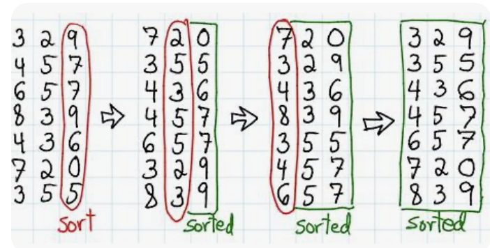

# Radix Sort

Write a function that takes in an array of non-negative integers and returns a sorted version of that array. Use the Radix Sort algorithm to sort the array.

If you're unfamiliar with Radix Sort, we recommend that you check zyBooks, where it is explained in great detail


## Sample Input
```python
array = [8762, 654, 3008, 345, 87, 65, 234, 12, 2]
```

## Sample Output
```python
[2, 12, 65, 87, 234, 345, 654, 3008, 8762]
```

## Hint

**Hint **  
Radix Sort algorithm is explained really well in zyBooks, check that out :) 
## Optimal Space & Time Complexity

- **Time Complexity:** O(d * (n + b)), where:
  - *n* is the length of the input array,
  - *d* is the maximum number of digits in the largest number,
  - *b* is the base of the numbering system used (typically 10 for decimal numbers).
  
- **Space Complexity:** O(n + b)
